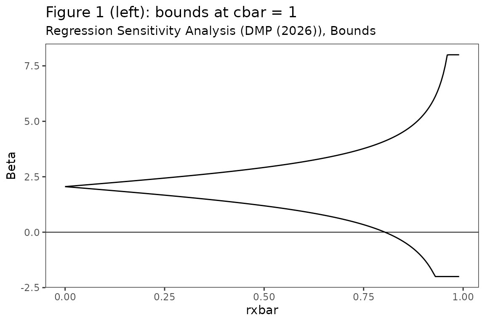
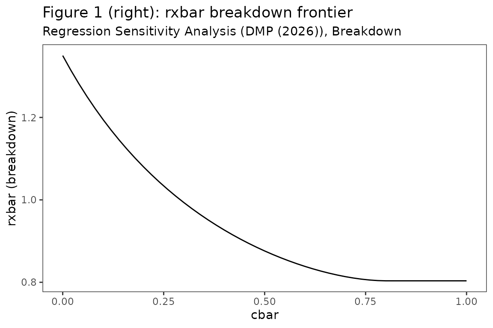
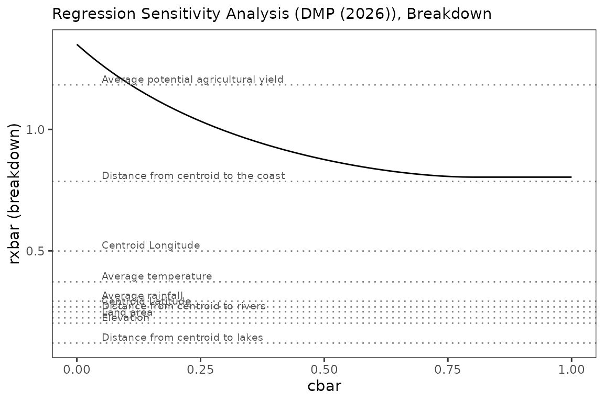
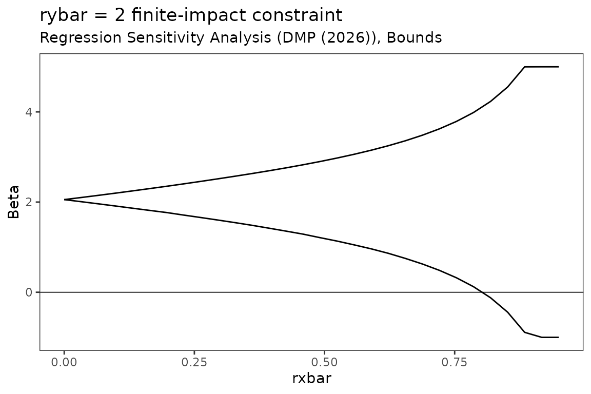

# Replication: Diegert, Masten and Poirier (2026)

This vignette reproduces every empirical table and figure of **Diegert,
Masten and Poirier (2026),** [*Assessing Omitted Variable Bias when the
Controls are Endogenous*](https://arxiv.org/abs/2206.02303), using the
bundled `bfg2020` data. We label each chunk with the corresponding
table/figure number in the paper.

``` r

library(regsensitivity)
library(ggplot2)
data(bfg2020)
bfg2020$statea <- factor(bfg2020$statea)

w1 <- c("log_area_2010", "lat", "lon", "temp_mean", "rain_mean",
        "elev_mean", "d_coa", "d_riv", "d_lak", "ave_gyi")
labels <- c(
    log_area_2010 = "Land area",
    lat           = "Centroid Latitude",
    lon           = "Centroid Longitude",
    temp_mean     = "Average temperature",
    rain_mean     = "Average rainfall",
    elev_mean     = "Elevation",
    d_coa         = "Distance from centroid to the coast",
    d_riv         = "Distance from centroid to rivers",
    d_lak         = "Distance from centroid to lakes",
    ave_gyi       = "Average potential agricultural yield"
)
form <- avgrep2000to2016 ~ tye_tfe890_500kNI_100_l6 +
    log_area_2010 + lat + lon + temp_mean + rain_mean + elev_mean +
    d_coa + d_riv + d_lak + ave_gyi + statea
```

## Table 1, Panel C, column (5): breakdown points

For the Republican vote share outcome the paper reports:

- $`\bar r_X^{bp} = 0.804`$ – the breakdown rxbar at $`\bar c = 1`$.
- $`\bar r^{bp} = 0.96`$ – the breakdown rxbar under
  $`\bar r_Y = \bar r_X`$ (common maximal impact).

``` r

bp_conservative <- regsen_bounds(form, bfg2020, compare = w1,
                                  cbar = 1)
bp_conservative$breakdown   # paper: 0.804
#> [1] 0.8035643

bp_relaxed <- regsen_bounds(form, bfg2020, compare = w1,
                             cbar = 1,
                             rybar_expr = function(rx) rx)
bp_relaxed$breakdown        # paper: 0.96
#> [1] 0.9583522
```

## Table 3: correlations between observed covariates

``` r

tbl3 <- calibrate_partial_r2(form, bfg2020, compare = w1)
tbl3$variable <- labels[tbl3$variable]
print(tbl3, row.names = FALSE)
#>                              variable         R2
#>                   Average temperature 0.89381557
#>                     Centroid Latitude 0.87613192
#>                             Elevation 0.68089635
#>  Average potential agricultural yield 0.64750896
#>                      Average rainfall 0.55877626
#>   Distance from centroid to the coast 0.48721297
#>                    Centroid Longitude 0.43437429
#>      Distance from centroid to rivers 0.13463383
#>       Distance from centroid to lakes 0.09985706
#>                             Land area 0.09812881
```

Matches the paper to three decimal places.

## Table 4, column (5): rho_k calibration

``` r

tbl4 <- calibrate_rho(form, bfg2020, compare = w1)
tbl4$variable <- labels[tbl4$variable]
print(tbl4, row.names = FALSE)
#>                              variable       rho
#>  Average potential agricultural yield 118.33963
#>   Distance from centroid to the coast  78.58110
#>                    Centroid Longitude  49.93006
#>                   Average temperature  37.26278
#>                      Average rainfall  29.28644
#>                     Centroid Latitude  26.92989
#>      Distance from centroid to rivers  24.95888
#>                             Land area  22.45564
#>                             Elevation  20.25159
#>       Distance from centroid to lakes  12.06453
```

Each value matches the paper’s Table 4 to one decimal place.

## Figure 1: Sensitivity analysis for Republican Vote Share

### Left panel: bounds on $`\beta_{long}`$ as a function of $`\bar r_X`$, $`\bar c = 1`$

``` r

fig1L <- regsen_bounds(form, bfg2020, compare = w1, cbar = 1,
                        rxbar = seq(0, 0.99, length.out = 200))
plot(fig1L, ylim = c(-2, 8),
     title = "Figure 1 (left): bounds at cbar = 1")
```



### Right panel: breakdown frontier $`\bar r_X^{bp}(\bar c)`$

``` r

fig1R <- regsen_breakdown(form, bfg2020, compare = w1,
                           cbar = seq(0, 1, 0.02))
plot(fig1R,
     title = "Figure 1 (right): rxbar breakdown frontier")
```



### Overlaying the calibration values

``` r

df_rho <- calibrate_rho(form, bfg2020, compare = w1)
df_rho$variable <- labels[df_rho$variable]
df_rho$rho_dec  <- df_rho$rho / 100  # express as fraction
plot(fig1R) +
    geom_hline(yintercept = df_rho$rho_dec, linetype = "dotted",
                colour = "grey50") +
    geom_text(data = df_rho,
               aes(x = 0.05, y = rho_dec, label = variable),
               hjust = 0, vjust = -0.3, size = 2.6, colour = "grey30")
```



## Figures 2 and 3

Figure 2 of DMP (2026) reports the same analysis for the *Cut Spending
on Poor* outcome, and Figure 3 reports a sensitivity analysis on the
choice of calibration covariates. Both require additional outcome
variables that are **not** part of the bundled `bfg2020` slice. Once the
full Bazzi-Fiszbein-Gebresilasse replication data is loaded, the calls
look like:

``` r
# Hypothetical, given a column `cut_spending_poor`:
regsen_bounds(cut_spending_poor ~ tye_tfe890_500kNI_100_l6 + <controls>,
              data, compare = w1, cbar = 1)
regsen_breakdown(cut_spending_poor ~ ...,
                  data, compare = w1, cbar = seq(0, 1, 0.02))
```

For Figure 3, vary the `compare` argument to include / exclude
calibration covariates:

``` r

for (drop in w1) {
    res <- regsen_bounds(form, bfg2020, compare = setdiff(w1, drop),
                          cbar = 1)
    # collect & plot
}
```

## Bonus: identified set under $`\bar r_Y < \infty`$

The paper notes that restricting the unobservable’s effect on the
outcome shrinks the identified set considerably. Reproducing Figure 4 of
the appendix style:

``` r

fy <- regsen_bounds(form, bfg2020, compare = w1, rybar = 2,
                     rxbar = seq(0, 0.95, length.out = 30))
plot(fy, ylim = c(-1, 5),
     title = "rybar = 2 finite-impact constraint")
```


