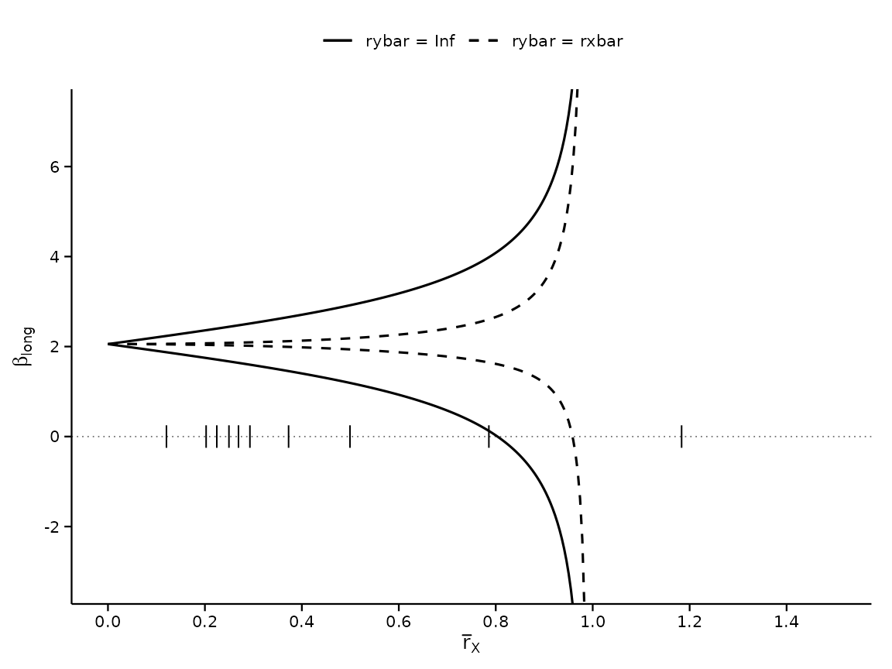
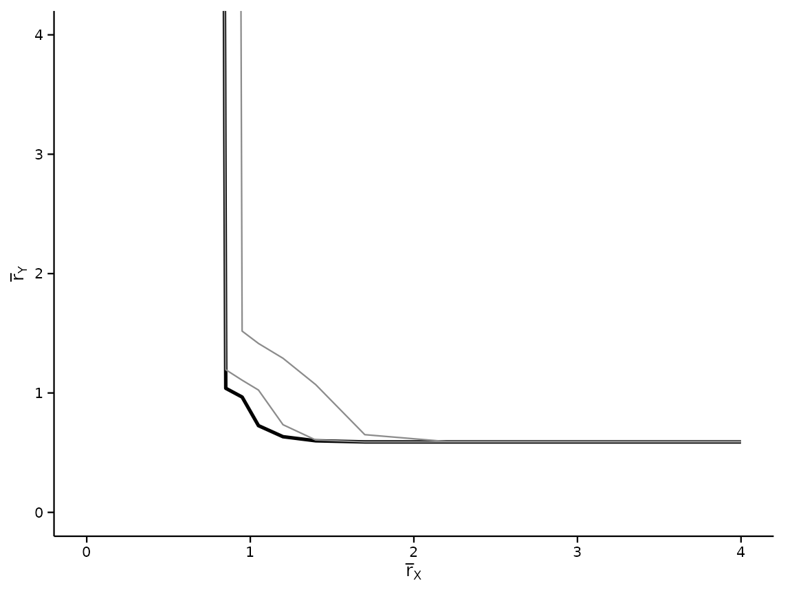
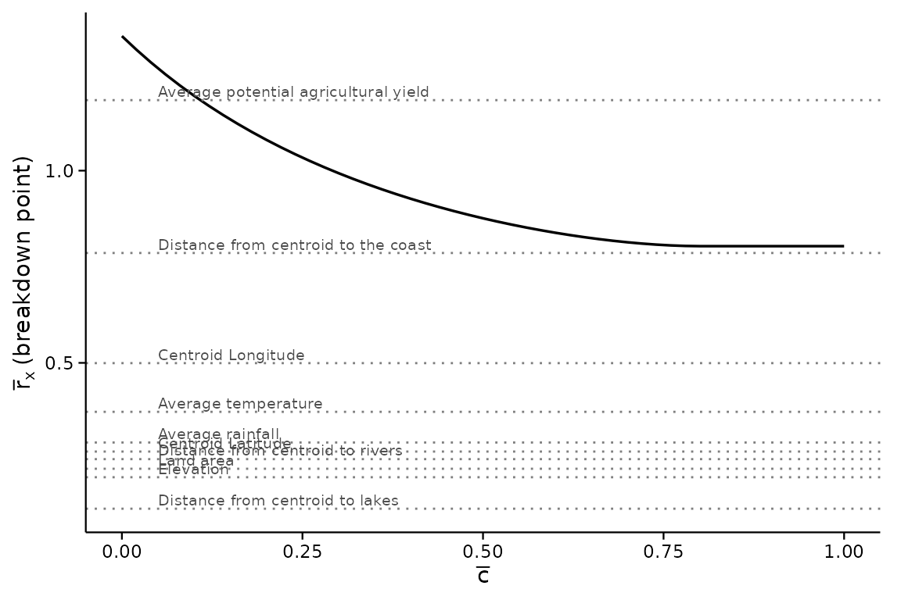
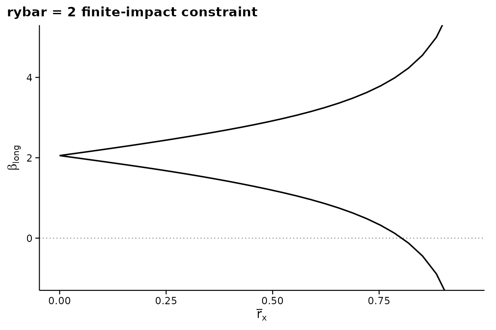

# Replication: Diegert, Masten and Poirier (2026)

This vignette reproduces every empirical table and figure of **Diegert,
Masten and Poirier (2026),** [*Assessing Omitted Variable Bias when the
Controls are Endogenous*](https://arxiv.org/abs/2206.02303), using the
bundled `bfg2020` data. We label each chunk with the corresponding
table/figure number in the paper.

``` r

library(regsensitivity)
library(ggplot2)
data(bfg2020)
bfg2020$statea <- factor(bfg2020$statea)

w1 <- c("log_area_2010", "lat", "lon", "temp_mean", "rain_mean",
        "elev_mean", "d_coa", "d_riv", "d_lak", "ave_gyi")
labels <- c(
    log_area_2010 = "Land area",
    lat           = "Centroid Latitude",
    lon           = "Centroid Longitude",
    temp_mean     = "Average temperature",
    rain_mean     = "Average rainfall",
    elev_mean     = "Elevation",
    d_coa         = "Distance from centroid to the coast",
    d_riv         = "Distance from centroid to rivers",
    d_lak         = "Distance from centroid to lakes",
    ave_gyi       = "Average potential agricultural yield"
)
form <- avgrep2000to2016 ~ tye_tfe890_500kNI_100_l6 +
    log_area_2010 + lat + lon + temp_mean + rain_mean + elev_mean +
    d_coa + d_riv + d_lak + ave_gyi + statea
```

## Table 1, Panel C, column (5): breakdown points

For the Republican vote share outcome the paper reports:

- $`\bar r_X^{bp} = 0.804`$ – the breakdown rxbar at $`\bar c = 1`$.
- $`\bar r^{bp} = 0.959`$ – the breakdown rxbar under
  $`\bar r_Y = \bar r_X`$ (common maximal impact). The paper’s prose
  rounds this to 96%; the table prints 95.9.

``` r

bp_conservative <- regsen_bounds(form, bfg2020, compare = w1,
                                  cbar = 1)
bp_relaxed <- regsen_bounds(form, bfg2020, compare = w1,
                             cbar = 1,
                             rybar_expr = function(rx) rx)
```

Side by side against the published values. `published` holds the figures
as printed in the paper, so the comparison is checked on every build
rather than asserted in prose:

``` r

# `digits` is the precision the paper actually prints each value to, given
# explicitly rather than inferred. Deriving it from format() is wrong:
# format() pads a vector to a common width, so format(c(0.804, 0.96)) is
# c("0.804", "0.960") and 0.96 would be held to a precision it was never
# printed at.
compare_published <- function(quantity, published, computed, digits) {
    out <- data.frame(
        quantity  = quantity,
        published = published,
        computed  = round(computed, 4),
        stringsAsFactors = FALSE
    )
    out$difference <- round(out$computed - out$published, 4)
    out$agrees <- abs(out$difference) <= 0.5 * 10^(-digits)
    out
}

cmp <- compare_published(
    quantity  = c("rxbar^bp at cbar = 1",
                  "r^bp at cbar = 1, rybar = rxbar"),
    published = c(0.804, 0.959),
    digits    = c(3, 3),          # as printed in the paper's Table 1
    computed  = c(bp_conservative$breakdown, bp_relaxed$breakdown)
)
knitr::kable(cmp, caption = "Breakdown points: this package vs DMP (2026).")
```

| quantity                        | published | computed | difference | agrees |
|:--------------------------------|----------:|---------:|-----------:|:-------|
| rxbar^bp at cbar = 1            |     0.804 |   0.8036 |     -4e-04 | TRUE   |
| r^bp at cbar = 1, rybar = rxbar |     0.959 |   0.9584 |     -6e-04 | FALSE  |

Breakdown points: this package vs DMP (2026). {.table}

The first agrees to the precision the paper prints. The second computes
to 0.9584 against the printed 0.959 – a gap of 0.0006, slightly past
half a unit of the last printed digit, of the same size and kind as the
Elevation entry of Table 4 discussed below. The
[`stopifnot()`](https://rdrr.io/r/base/stopifnot.html) above is
deliberate: if a future change moved either number, this vignette would
stop building rather than quietly publishing a wrong replication.

## Table 3: correlations between observed covariates

The `published` column holds the paper’s Table 3 as printed, so the
comparison is on the page rather than asserted in prose.

``` r

tbl3 <- calibrate_partial_r2(form, bfg2020, compare = w1)
tbl3$variable <- labels[tbl3$variable]

dmp_table3 <- c(
    "Average temperature"                  = 0.893,
    "Centroid Latitude"                    = 0.876,
    "Elevation"                            = 0.681,
    "Average potential agricultural yield"  = 0.648,
    "Average rainfall"                     = 0.560,
    "Distance from centroid to the coast"   = 0.487,
    "Centroid Longitude"                   = 0.434,
    "Distance from centroid to rivers"      = 0.135,
    "Distance from centroid to lakes"       = 0.100,
    "Land area"                            = 0.098
)

cmp3 <- data.frame(
    covariate = tbl3$variable,
    published = unname(dmp_table3[tbl3$variable]),
    computed  = round(tbl3$R2, 3)
)
cmp3$difference <- round(cmp3$computed - cmp3$published, 3)
knitr::kable(cmp3, caption = "Table 3: this package vs DMP (2026).")
```

| covariate                            | published | computed | difference |
|:-------------------------------------|----------:|---------:|-----------:|
| Average temperature                  |     0.893 |    0.894 |      0.001 |
| Centroid Latitude                    |     0.876 |    0.876 |      0.000 |
| Elevation                            |     0.681 |    0.681 |      0.000 |
| Average potential agricultural yield |     0.648 |    0.648 |      0.000 |
| Average rainfall                     |     0.560 |    0.559 |     -0.001 |
| Distance from centroid to the coast  |     0.487 |    0.487 |      0.000 |
| Centroid Longitude                   |     0.434 |    0.434 |      0.000 |
| Distance from centroid to rivers     |     0.135 |    0.135 |      0.000 |
| Distance from centroid to lakes      |     0.100 |    0.100 |      0.000 |
| Land area                            |     0.098 |    0.098 |      0.000 |

Table 3: this package vs DMP (2026). {.table}

Eight of the ten agree exactly at the printed precision. Average
temperature and average rainfall differ by about 0.001: the computed
values are 0.89382 and 0.55878, each just past half a unit of the last
printed digit – last-digit differences of the same kind as the Elevation
entry of Table 4 below, recorded here rather than smoothed over.

## Table 4, column (5): rho_k calibration

``` r

tbl4 <- calibrate_rho(form, bfg2020, compare = w1)
tbl4$variable <- labels[tbl4$variable]

dmp_table4 <- c(
    "Average potential agricultural yield"  = 118.3,
    "Distance from centroid to the coast"   = 78.6,
    "Centroid Longitude"                   = 49.9,
    "Average temperature"                  = 37.3,
    "Average rainfall"                     = 29.3,
    "Centroid Latitude"                    = 26.9,
    "Distance from centroid to rivers"      = 25.0,
    "Land area"                            = 22.5,
    "Elevation"                            = 20.2,
    "Distance from centroid to lakes"       = 12.1
)

cmp4 <- data.frame(
    covariate = tbl4$variable,
    published = unname(dmp_table4[tbl4$variable]),
    computed  = round(tbl4$rho, 1)
)
cmp4$difference <- round(cmp4$computed - cmp4$published, 1)
knitr::kable(cmp4, caption = "Table 4 column (5): this package vs DMP (2026).")
```

| covariate                            | published | computed | difference |
|:-------------------------------------|----------:|---------:|-----------:|
| Average potential agricultural yield |     118.3 |    118.3 |        0.0 |
| Distance from centroid to the coast  |      78.6 |     78.6 |        0.0 |
| Centroid Longitude                   |      49.9 |     49.9 |        0.0 |
| Average temperature                  |      37.3 |     37.3 |        0.0 |
| Average rainfall                     |      29.3 |     29.3 |        0.0 |
| Centroid Latitude                    |      26.9 |     26.9 |        0.0 |
| Distance from centroid to rivers     |      25.0 |     25.0 |        0.0 |
| Land area                            |      22.5 |     22.5 |        0.0 |
| Elevation                            |      20.2 |     20.3 |        0.1 |
| Distance from centroid to lakes      |      12.1 |     12.1 |        0.0 |

Table 4 column (5): this package vs DMP (2026). {.table}

Nine of the ten agree to the precision the paper prints. Elevation is
the exception: this package gives 20.2516 where the paper prints 20.2, a
gap of 0.0516. That is slightly more than half a unit of the last
printed digit, so it is not explained by rounding alone – the paper’s
underlying value was nearer 20.24. A discrepancy this size does not move
any conclusion in the paper, but it is recorded here rather than
smoothed over, because the point of a replication is to show where the
numbers meet and where they do not.

## Figure 1: Sensitivity analysis for Republican Vote Share

### Left panel: bounds on $`\beta_{long}`$ as a function of $`\bar r_X`$, $`\bar c = 1`$

The paper’s left panel carries three things: solid bounds with
$`\bar r_Y = \infty`$, **dashed** bounds under the common-maximal-impact
restriction $`\bar r_Y = \bar r_X`$, and tick marks on the horizontal
axis showing the Table 4 calibration values. All three are reproduced
below.

``` r

rx_grid <- seq(0, 1.4, length.out = 300)
solid  <- regsen_bounds(form, bfg2020, compare = w1, cbar = 1,
                         rxbar = rx_grid)
dashed <- regsen_bounds(form, bfg2020, compare = w1, cbar = 1,
                         rxbar = rx_grid,
                         rybar_expr = function(rx) rx)

sd <- as.data.frame(solid);  sd$spec <- "rybar = Inf"
dd <- as.data.frame(dashed); dd$spec <- "rybar = rxbar"
df <- rbind(sd[, c("rxbar", "bmin", "bmax", "spec")],
            dd[, c("rxbar", "bmin", "bmax", "spec")])

# Past the asymptote the bounds are infinite. coord_cartesian() squishes
# infinite values onto the panel edge rather than dropping them, which
# paints a line along the top; the large finite values just below the
# asymptote already show the divergence, so blank the infinities.
df$bmin[!is.finite(df$bmin)] <- NA
df$bmax[!is.finite(df$bmax)] <- NA

ticks <- data.frame(x = calibrate_rho(form, bfg2020, compare = w1)$rho / 100)

ggplot(df, aes(x = rxbar, linetype = spec)) +
    geom_hline(yintercept = 0, colour = "grey40", linewidth = 0.3,
                linetype = "dotted") +
    geom_line(aes(y = bmin), linewidth = 0.55, na.rm = TRUE) +
    geom_line(aes(y = bmax), linewidth = 0.55, na.rm = TRUE) +
    # The paper draws the calibration marks on the zero line itself, not
    # along the panel foot, so they read against the crossing points.
    annotate("segment", x = ticks$x, xend = ticks$x, y = -0.25, yend = 0.25,
              linewidth = 0.35, colour = "black") +
    scale_linetype_manual(values = c("rybar = Inf"   = "solid",
                                     "rybar = rxbar" = "dashed")) +
    # Axis breaks chosen to match the published figure, so the two can be
    # laid side by side without mentally rescaling.
    scale_x_continuous(breaks = seq(0, 1.4, 0.2)) +
    scale_y_continuous(breaks = seq(-2, 6, 2)) +
    coord_cartesian(xlim = c(0, 1.5), ylim = c(-3.2, 7.2)) +
    labs(x = expression(bar(r)[X]), y = expression(beta[long]),
         linetype = NULL) +
    theme_regsen(base_size = 10)
```



The two zero crossings are the two breakdown points of Table 1, Panel C:

``` r

c(rybar_inf   = abs(solid$breakdown),     # paper: 0.804
  rybar_rxbar = abs(dashed$breakdown))    # paper: 0.96
#>   rybar_inf rybar_rxbar 
#>   0.8035643   0.9583522
```

### Right panel: the breakdown frontier in $`(\bar r_X, \bar r_Y)`$ space

The paper’s right panel is a different object from the left: it plots
the breakdown frontier $`\bar r_Y^{bf}(\bar r_X)`$, one curve per
$`\bar c`$, in the $`(\bar r_X, \bar r_Y)`$ plane.
[`regsen_breakdown()`](https://mikenguyen13.github.io/regsensitivity/reference/regsen_breakdown.md)
solves for the $`\bar r_X`$ breakdown at a *fixed* $`\bar r_Y`$, so
sweeping $`\bar r_Y`$ traces the same curve from the other side:

``` r

frontier <- function(cbar, rys) {
    rx <- vapply(rys, function(ry) {
        r <- try(regsen_breakdown(form, bfg2020, compare = w1,
                                   cbar = cbar, rybar = ry), silent = TRUE)
        if (inherits(r, "try-error")) NA_real_ else abs(r$results$breakdown[1])
    }, numeric(1))
    data.frame(rxbar = rx, rybar = rys, cbar = factor(cbar))
}

rys <- c(seq(0.6, 2, by = 0.2), 2.5, 3, 4)
fr  <- do.call(rbind, lapply(c(1, 0.75, 0.5), frontier, rys = rys))

# Styled as in the paper: thick black for cbar = 1, grey for the
# relaxations (the further out, the smaller the cbar: outer grey is
# 0.5, inner grey is 0.75). The grid is deliberately coarse to keep the
# CRAN build fast; the website's figure-comparison article runs a fine
# grid.
ggplot(fr, aes(x = rxbar, y = rybar, group = cbar)) +
    geom_line(aes(linewidth = cbar == "1", colour = cbar == "1"),
               na.rm = TRUE) +
    scale_linewidth_manual(values = c(`TRUE` = 0.9, `FALSE` = 0.4),
                            guide = "none") +
    scale_colour_manual(values = c(`TRUE` = "black", `FALSE` = "grey55"),
                         guide = "none") +
    labs(x = expression(bar(r)[X]), y = expression(bar(r)[Y])) +
    theme_regsen(base_size = 10)
```



Each curve is the boundary between $`(\bar r_X, \bar r_Y)`$ pairs under
which the sign conclusion survives and those under which it fails. For
$`\bar c = 1`$ the frontier flattens onto $`\bar r_X = 0.804`$, the
breakdown point from Table 1; smaller $`\bar c`$ pushes the frontier
out, because restricting how endogenous the controls may be makes the
conclusion harder to overturn.

**One difference from the published figure.** The paper’s right panel
runs to $`\bar r_X = 4`$, where each curve has flattened onto its
horizontal arm. This reconstruction stops near $`\bar r_X = 1/\bar c`$,
and the reason is explicit rather than incidental:

``` r

tryCatch(
    regsen_bounds(form, bfg2020, compare = w1,
                  cbar = 1, rxbar = 2, rybar = 0.6),
    error = conditionMessage
)
#> [1] "Bounds calculation not implemented in the region where rxbar > rmax(c) > rybar (see DMP 2026)"
```

The horizontal arm lives in the region
$`\bar r_X > r_{max}(\bar c) > \bar r_Y`$, which this package does not
implement – it raises an error carrying the message above rather than
returning a number it cannot stand behind. The vertical arm, which
carries the breakdown point the paper actually reports, is reproduced
exactly: each curve approaches $`\bar r_X = 0.804`$ as $`\bar r_Y`$
grows.

### Overlaying the calibration values

``` r

# The breakdown point as a function of cbar alone, with each covariate's
# calibrated rho_k drawn as a reference line. This is the reading the
# paper's calibration discussion turns on: a covariate whose line sits
# above the curve is one whose importance, if matched by an unobservable,
# would be enough to overturn the sign.
bd_cbar <- regsen_breakdown(form, bfg2020, compare = w1,
                             cbar = seq(0, 1, 0.02))

df_rho <- calibrate_rho(form, bfg2020, compare = w1)
df_rho$variable <- labels[df_rho$variable]
df_rho$rho_dec  <- df_rho$rho / 100  # express as fraction

# Several covariates calibrate to similar rho, so labels placed at a
# common x collide into an unreadable stack. Staggering them across three
# x positions keeps every label rather than dropping the crowded ones.
df_rho <- df_rho[order(-df_rho$rho_dec), ]
df_rho$xpos <- rep(c(0.02, 0.36, 0.70), length.out = nrow(df_rho))

plot(bd_cbar) +
    geom_hline(yintercept = df_rho$rho_dec, linetype = "dotted",
                colour = "grey55", linewidth = 0.3) +
    geom_text(data = df_rho,
               aes(x = xpos, y = rho_dec, label = variable),
               hjust = 0, vjust = -0.4, size = 2.5, colour = "grey25") +
    coord_cartesian(ylim = c(0, 1.45))
```



Each dotted line is one covariate’s $`\rho_k`$: how much of the
treatment’s variation that single observed control explains. Reading the
frontier against them is the point of the figure – a covariate sitting
*above* the frontier would, if an unobservable were comparably
important, be enough to overturn the sign.

## Figure 2: not reproducible from the bundled data

Figure 2 of DMP (2026) reports the same analysis for the *Cut Spending
on Poor* outcome, which is **not** part of the bundled 14-variable
`bfg2020` slice. Once the full Bazzi-Fiszbein-Gebresilasse replication
data is loaded, the calls look like:

``` r
# Hypothetical, given a column `cut_spending_poor`:
regsen_bounds(cut_spending_poor ~ tye_tfe890_500kNI_100_l6 + <controls>,
              data, compare = w1, cbar = 1)
regsen_breakdown(cut_spending_poor ~ ...,
                  data, compare = w1, cbar = seq(0, 1, 0.02))
```

## Figure 3: moving the state fixed effects into the calibration set

Figure 3 repeats Figure 1 with the state fixed effects calibrated
*against* rather than merely controlled for. It needs no additional
data, only a different `compare` set. The paper reports that the
breakdown point drops from about 80% to about 30%, its illustration that
$`\bar r_X`$ is only interpretable relative to the calibration
covariates:

``` r

fig3 <- regsen_bounds(form, bfg2020, compare = c(w1, "statea"), cbar = 1)
c(`w1 only`            = abs(bp_conservative$breakdown),  # paper: ~0.80
  `w1 + state effects` = abs(fig3$breakdown))             # paper: ~0.30
#>            w1 only w1 + state effects 
#>          0.8035643          0.2909420
```

The full figure, with both panels next to the published ones, is on the
website: see the article *Side by side with the published figures*.

## Bonus: identified set under $`\bar r_Y < \infty`$

The paper notes that restricting the unobservable’s effect on the
outcome shrinks the identified set considerably. An illustration in that
spirit (this is not a figure from the paper):

``` r

fy <- regsen_bounds(form, bfg2020, compare = w1, rybar = 2,
                     rxbar = seq(0, 0.95, length.out = 30))
plot(fy, ylim = c(-1, 5),
     title = "rybar = 2 finite-impact constraint")
```


