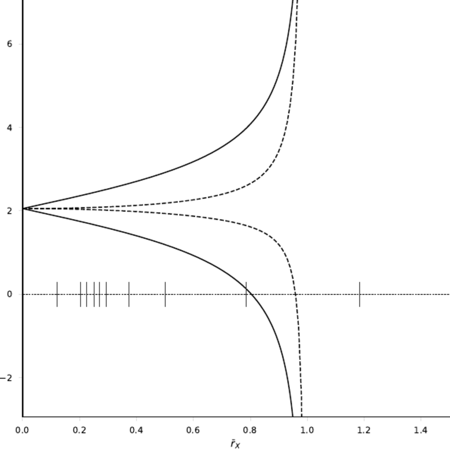
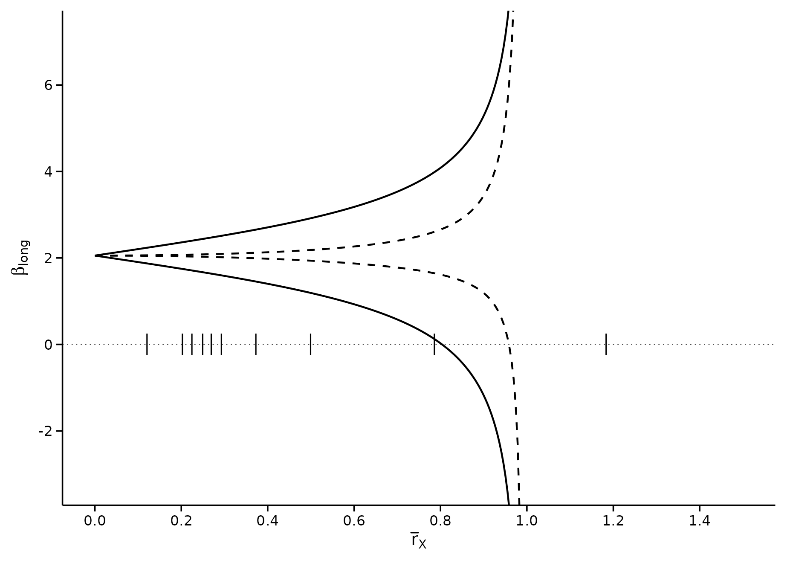
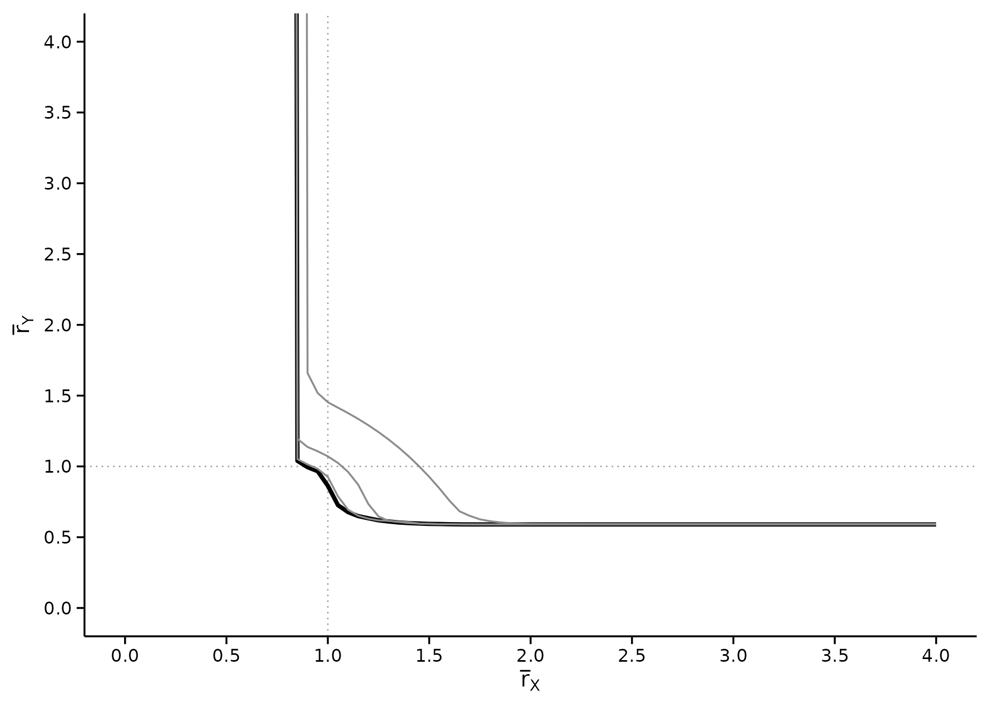
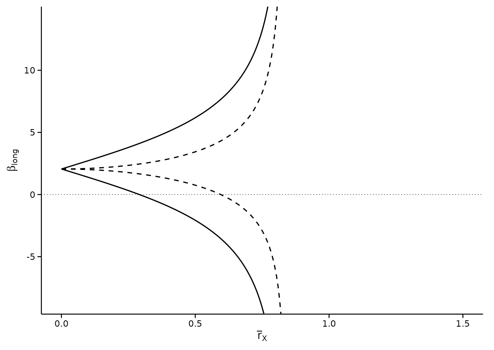
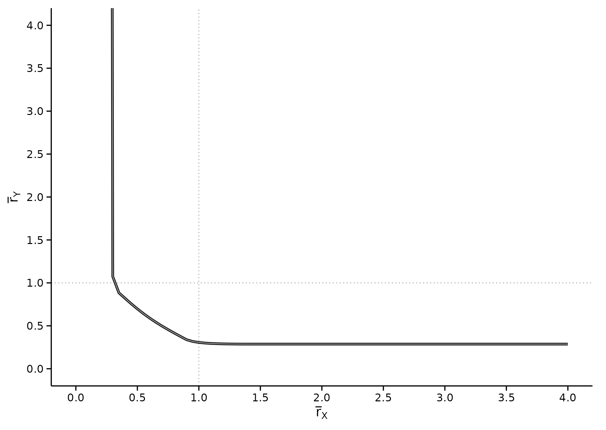

# Side by side with the published figures

A replication that only reports numbers asks you to trust that the
figures line up too. This page puts them next to each other.

The published panels are reproduced from **Diegert, Masten and Poirier
(2026),** [*Assessing Omitted Variable Bias when the Controls are
Endogenous*](https://arxiv.org/abs/2206.02303) (arXiv:2206.02303v6) and
**Masten and Poirier (2026),** [*The Effect of Omitted Variables on the
Sign of Regression Coefficients*](https://arxiv.org/abs/2208.00552)
(arXiv:2208.00552v5), for the purpose of comparison. Copyright rests
with the authors. The panels beneath each one are produced by this
package from the bundled `bfg2020` data, by the code shown with them.

This page is part of the website only. It is excluded from the package
tarball, so the reproduced figures are not redistributed on CRAN.

## Figure 1, left panel

Bounds on $`\beta_{long}`$ against $`\bar r_X`$ at $`\bar c = 1`$. Solid
lines leave $`\bar r_Y`$ unrestricted; dashed lines impose
$`\bar r_Y = \bar r_X`$. The marks on the zero line are the Table 4
calibration values.

### DMP (2026), as published



### regsensitivity

``` r

rx <- seq(0, 1.4, length.out = 300)
solid  <- regsen_bounds(form, bfg2020, compare = w1, cbar = 1, rxbar = rx)
dashed <- regsen_bounds(form, bfg2020, compare = w1, cbar = 1, rxbar = rx,
                         rybar_expr = function(r) r)

a <- as.data.frame(solid);  a$spec <- "rybar = Inf"
b <- as.data.frame(dashed); b$spec <- "rybar = rxbar"
df <- rbind(a[, c("rxbar", "bmin", "bmax", "spec")],
            b[, c("rxbar", "bmin", "bmax", "spec")])
df$bmin[!is.finite(df$bmin)] <- NA
df$bmax[!is.finite(df$bmax)] <- NA
ticks <- calibrate_rho(form, bfg2020, compare = w1)$rho / 100

ggplot(df, aes(x = rxbar, linetype = spec)) +
    geom_hline(yintercept = 0, colour = "grey30", linewidth = 0.3,
                linetype = "dotted") +
    geom_line(aes(y = bmin), linewidth = 0.5, na.rm = TRUE) +
    geom_line(aes(y = bmax), linewidth = 0.5, na.rm = TRUE) +
    annotate("segment", x = ticks, xend = ticks, y = -0.25, yend = 0.25,
              linewidth = 0.35, colour = "black") +
    scale_linetype_manual(values = c("rybar = Inf"   = "solid",
                                     "rybar = rxbar" = "dashed")) +
    scale_x_continuous(breaks = seq(0, 1.4, 0.2)) +
    scale_y_continuous(breaks = seq(-2, 6, 2)) +
    coord_cartesian(xlim = c(0, 1.5), ylim = c(-3.2, 7.2)) +
    labs(x = expression(bar(r)[X]), y = expression(beta[long]),
         linetype = NULL) +
    theme_regsen(base_size = 10) +
    theme(legend.position = "none")
```



The two curves cross zero at the paper’s two breakdown points:

``` r

c(`rybar = Inf`   = abs(solid$breakdown),    # paper: 0.804
  `rybar = rxbar` = abs(dashed$breakdown))   # paper: 0.959 (96% in prose)
#>   rybar = Inf rybar = rxbar 
#>     0.8035643     0.9583504
```

Both bounds go infinite at $`\bar r_X = 1`$ under the dashed
specification, and just below 1 under the solid one, which is where both
curves leave the panel in the published figure too.

## Figure 1, right panel

The breakdown frontier in $`(\bar r_X, \bar r_Y)`$ space, one curve per
$`\bar c`$.

### DMP (2026), as published


### regsensitivity

``` r

# The frontier in the rybar direction: one solve per rxbar, parallelised
# across the grid (forking is unavailable on Windows, hence the fallback).
frontier <- function(cbar, rxs, w = w1) {
    cores <- if (.Platform$OS.type == "windows") 1L else
        min(4L, max(1L, parallel::detectCores(), na.rm = TRUE))
    res <- parallel::mclapply(rxs, function(rx) {
        r <- regsen_breakdown(form, bfg2020, compare = w, cbar = cbar,
                               direction = "rybar", rxbar = rx)
        r$results$breakdown[1]
    }, mc.cores = cores)
    ry <- vapply(res, function(z) if (is.numeric(z)) z else NA_real_,
                 numeric(1))
    data.frame(rxbar = rxs, rybar = ry, cbar = factor(cbar))
}
# Dense through the bend; the flat arm to the right needs only anchors.
rxs <- c(seq(0.7, 2, by = 0.05), 2.25, 2.5, 3, 3.5, 4)
fr  <- do.call(rbind, lapply(c(1, 0.9, 0.75, 0.5), frontier, rxs = rxs))

# Below its breakdown point in rxbar the conclusion survives every rybar,
# so the frontier is +Inf there: send those points off the top of the
# panel and let coord_cartesian clip, which is the vertical arm.
fr$rybar[!is.finite(fr$rybar)] <- 40

# As in the paper: thick black is cbar = 1; the greys are 0.9, 0.75,
# and 0.5, moving outward. Dotted guides mark rxbar = rybar = 1.
frontier_plot <- function(fr) {
    ggplot(fr, aes(x = rxbar, y = rybar, group = cbar)) +
        geom_hline(yintercept = 1, colour = "grey60", linewidth = 0.3,
                    linetype = "dotted") +
        geom_vline(xintercept = 1, colour = "grey60", linewidth = 0.3,
                    linetype = "dotted") +
        geom_line(aes(linewidth = cbar == "1", colour = cbar == "1"),
                   na.rm = TRUE) +
        scale_linewidth_manual(values = c(`TRUE` = 0.9, `FALSE` = 0.4),
                                guide = "none") +
        scale_colour_manual(values = c(`TRUE` = "black",
                                        `FALSE` = "grey55"),
                             guide = "none") +
        scale_x_continuous(breaks = seq(0, 4, 0.5)) +
        scale_y_continuous(breaks = seq(0, 4, 0.5)) +
        coord_cartesian(xlim = c(0, 4), ylim = c(0, 4)) +
        labs(x = expression(bar(r)[X]), y = expression(bar(r)[Y])) +
        theme_regsen(base_size = 10)
}
frontier_plot(fr)
```



Both arms are here. The vertical one sits at the breakdown point of
Table 1, Panel C – each curve approaches $`\bar r_X = 0.804`$ as
$`\bar r_Y`$ grows – and the horizontal one is the level of $`\bar r_Y`$
below which no amount of selection on the treatment side overturns the
sign, which is what the curve flattening onto it means.

The horizontal arm is the part that needed the frontier in the
$`\bar r_Y`$ direction. Sweeping $`\bar r_Y`$ and solving for
$`\bar r_X`$ cannot draw it, because along that arm the answer is
$`+\infty`$: every $`\bar r_X`$ leaves the conclusion standing.

``` r

# Far out on the horizontal arm, where the identified set is still
# bounded because rybar is restricted even though rxbar is not.
regsen_bounds(form, bfg2020, compare = w1, cbar = 1,
              rxbar = 2, rybar = 0.6)$results
#>   rxbar rybar cbar        bmin    bmax
#> 1     2   0.6    1 -0.05202383 4.31302

# ... and the rybar frontier at the same rxbar, which is what the curve
# above plots.
regsen_breakdown(form, bfg2020, compare = w1, cbar = 1,
                 direction = "rybar", rxbar = 2)$results
#>   index breakdown
#> 1     2 0.5901671
```

## Figure 3: calibrating with state fixed effects

Figure 3 repeats Figure 1 with the state fixed effects moved *into* the
calibration set. The paper’s point is that $`\bar r_X`$ is only
meaningful relative to the covariates it calibrates against: adding
controls with a lot of explanatory power raises selection on
observables, so the same data yields a much smaller breakdown point –
the paper says it drops from about 80% to **about 30%**.

### DMP (2026), as published


### regsensitivity

``` r

w1_fe <- c(w1, "statea")          # state fixed effects now calibrate too
s3 <- regsen_bounds(form, bfg2020, compare = w1_fe, cbar = 1, rxbar = rx)
d3 <- regsen_bounds(form, bfg2020, compare = w1_fe, cbar = 1, rxbar = rx,
                     rybar_expr = function(r) r)

a3 <- as.data.frame(s3); a3$spec <- "rybar = Inf"
b3 <- as.data.frame(d3); b3$spec <- "rybar = rxbar"
df3 <- rbind(a3[, c("rxbar", "bmin", "bmax", "spec")],
             b3[, c("rxbar", "bmin", "bmax", "spec")])
df3$bmin[!is.finite(df3$bmin)] <- NA
df3$bmax[!is.finite(df3$bmax)] <- NA

ggplot(df3, aes(x = rxbar, linetype = spec)) +
    geom_hline(yintercept = 0, colour = "grey30", linewidth = 0.3,
                linetype = "dotted") +
    geom_line(aes(y = bmin), linewidth = 0.5, na.rm = TRUE) +
    geom_line(aes(y = bmax), linewidth = 0.5, na.rm = TRUE) +
    scale_linetype_manual(values = c("rybar = Inf"   = "solid",
                                     "rybar = rxbar" = "dashed")) +
    # The published Figure 3 panel uses a wider y window than Figure 1,
    # so the reproduction adopts the same one.
    scale_y_continuous(breaks = seq(-5, 10, 5)) +
    coord_cartesian(xlim = c(0, 1.5), ylim = c(-8.5, 14)) +
    labs(x = expression(bar(r)[X]), y = expression(beta[long]),
         linetype = NULL) +
    theme_regsen(base_size = 10) +
    theme(legend.position = "none")
```



The published Figure 3 also has a right panel: the breakdown frontiers
recomputed with the state fixed effects in the calibration set. All of
them have shifted inward, the point the paper makes in the surrounding
text.

``` r

rxs3 <- c(seq(0.25, 2, by = 0.05), 2.25, 2.5, 3, 3.5, 4)
fr3  <- do.call(rbind, lapply(c(1, 0.75), frontier, rxs = rxs3, w = w1_fe))
fr3$rybar[!is.finite(fr3$rybar)] <- 40
frontier_plot(fr3)
```



Both arms again, with the vertical one now near 0.29 instead of 0.80 –
the inward shift the paper describes.

``` r

c(`w1 only`            = abs(solid$breakdown),   # paper: ~0.80
  `w1 + state effects` = abs(s3$breakdown))      # paper: ~0.30
#>            w1 only w1 + state effects 
#>          0.8035643          0.2909420
```

## Masten and Poirier (2026), Figures 1 and 2

These two are built on the authors’ application to Satyanath et al.
(2017), which is not bundled with this package, and the paper does not
report the moments needed to rebuild the curves – it prints coefficients
and breakdown points, but no R-squared values and no variances. A full
numerical reproduction would require re-running the regressions on the
Satyanath et al. microdata (Harvard Dataverse,
<doi:10.7910/DVN/EE6I7N>). The figures are shown here for structure,
next to the stylized illustration in the [MP examples
vignette](https://mikenguyen13.github.io/regsensitivity/articles/mp2022-stylized.md).

**This is not a numerical reproduction, and it should not be read as
one.** In the published figure the sign-change breakdown is 0.586 while
the explain-away breakdown is $`|-32|`$ – a separation of a factor of
55, which is precisely the asymmetry the figure exists to demonstrate.
In constructed data the two quantities come out close together;
reproducing the gap needs the actual Satyanath moments, not a
plausible-looking substitute.

### MP (2026) Figure 1, as published


### MP (2026) Figure 2, as published


The structural features do carry over to constructed data: the
identified set has at most three branches, and they diverge at the
vertical asymptote $`\delta = 1`$. Both are visible in the stylized
figures in that vignette.

## Coverage: every figure in the three papers

| Figure | Status | Reason |
|:---|:---|:---|
| DMP Fig 1 (left) | reproduced | matches on both specifications; crossings 0.8036 / 0.9584 |
| DMP Fig 1 (right) | reproduced | both arms match; the horizontal one is drawn in the rybar direction |
| DMP Fig 2 | not reproducible | outcome ‘Cut Spending on Poor’ is not in the bundled bfg2020 data |
| DMP Fig 3 (left) | reproduced | matches; breakdown falls to 0.2909 against the paper’s ‘about 30%’ |
| DMP Fig 3 (right) | reproduced | matches, shifted inward as in the paper |
| MP Fig 1 | structure only | built on Satyanath et al. (2017); moments not reported in full |
| MP Fig 2 | structure only | as Figure 1 |
| MP Fig S1 | not reproducible | Satyanath et al. (2017) data, not bundled |
| Oster Figs 1, 4-6 | out of scope | meta-analysis over Oster’s hand-collected samples of published papers (Figs 1, 4, 5: the 27-paper coefficient-stability sample; Fig 6: her randomized-trials sample) |
| Oster Fig 2 | out of scope | a Monte Carlo of the bias-adjusted estimator’s sampling distribution, a simulation study rather than an analysis the package performs |
| Oster Fig 3 | out of scope | NLSY-79 validation exercise with a bespoke data construction, not a package analysis |

What replicates, what does not, and why. {.table}

Every panel this package’s methods can produce from the bundled data is
reproduced above, in full: both bounds panels and both frontier panels,
each frontier with both of its arms. The rest need data that is not
distributed with the package – the full BFG outcome set, or the
Satyanath et al. microdata – or, in Oster’s case, are simulation and
literature meta-analysis exercises rather than sensitivity analyses of a
dataset.

## Summary

|                                                 | Published | This package |
|-------------------------------------------------|-----------|--------------|
| $`\bar r_X^{bp}`$ at $`\bar c = 1`$             | 0.804     | 0.8036       |
| $`\bar r^{bp}`$, $`\bar r_Y = \bar r_X`$        | 0.959     | 0.9584       |
| $`\bar r_X^{bp}`$, calibrating on state effects | ~0.30     | 0.2909       |
