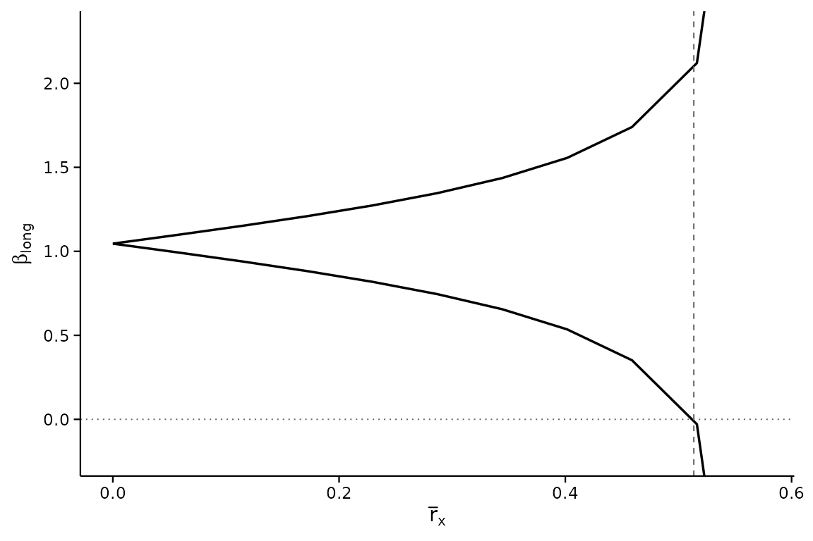
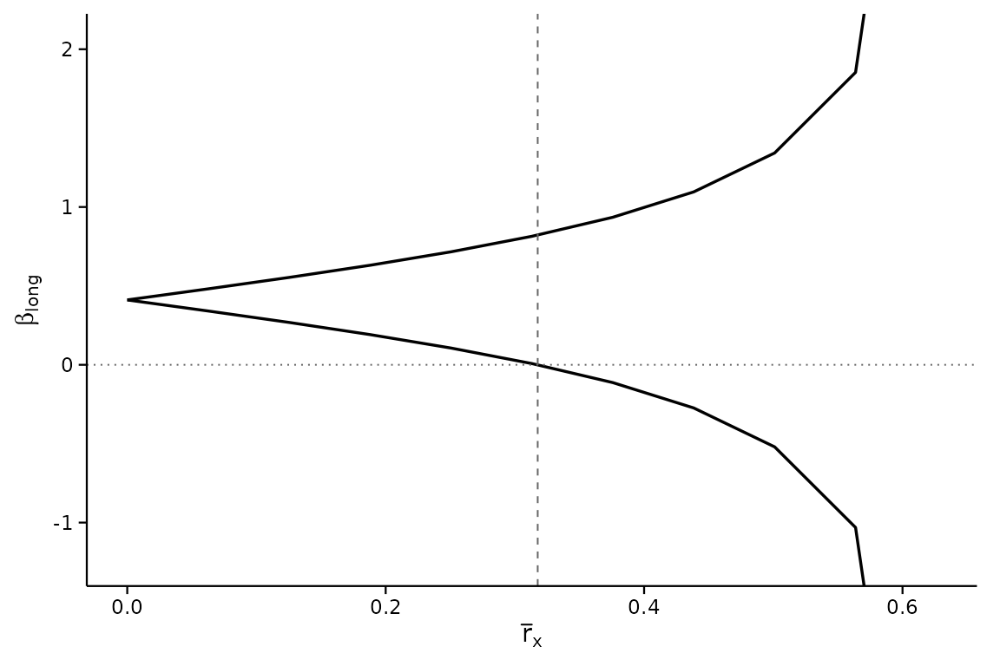
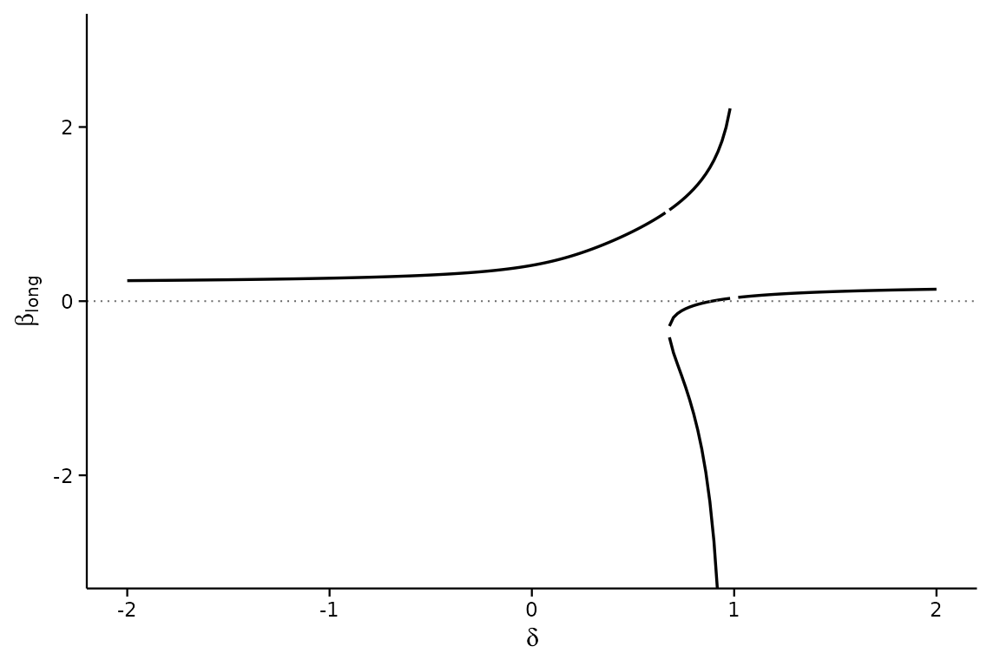

# Reading the output: interpretation, edge cases and decisions

The tour vignette shows how to call the package. This one is about what
comes back: what each number means, what to conclude from it, what to
write in the paper, and what the output looks like in the situations
that confuse people – an unbounded set, a breakdown point of zero or
infinity, a large Oster $`\delta`$ next to a small sign-change
$`\delta`$. It is written for the author who has to defend the analysis
and for the referee who has to judge it.

Most examples use simulated data in which the omitted variable *exists*
and is simply hidden from the analysis, so you can see the analysis get
it right, and see what it looks like when a conclusion is genuinely
fragile. One section uses the bundled BFG (2020) data for a real case.

``` r

# A world with six observed covariates w1..w6 and one omitted variable u.
# `beta` is the true effect of x; pi2 and g2 are u's effects on x and y.
make_world <- function(seed, beta, pi2, g2, pi1 = rep(0.6, 6), sy = 1,
                       n = 2000) {
    set.seed(seed)
    w <- matrix(rnorm(n * 6), n, 6, dimnames = list(NULL, paste0("w", 1:6)))
    u <- 0.3 * w[, 1] + rnorm(n)
    x <- w %*% pi1 + pi2 * u + rnorm(n)
    y <- beta * x + w %*% rep(c(0.4, -0.3), 3) + g2 * u + rnorm(n) * sy
    d <- data.frame(y = as.numeric(y), x = as.numeric(x), w)
    d$u <- u          # kept only so we can check the truth; never used
    d
}
w1   <- paste0("w", 1:6)
form <- y ~ x + w1 + w2 + w3 + w4 + w5 + w6
truth <- function(d) unname(coef(lm(update(form, . ~ . + u), d))["x"])
```

## The numbers, and what each one means

| Where it appears | Name | What it is | How to read it |
|----|----|----|----|
| header, `$dgp$beta_med` | $`\beta_{\text{med}}`$ | the coefficient on $`X`$ from the regression you can run | the estimate under “no selection on unobservables” |
| header, `$breakdown` | breakdown point $`\bar r_X^{bp}`$ | the smallest $`\bar r_X`$ at which the hypothesis (default: the sign of $`\beta_{\text{med}}`$) can fail | an unobservable would need to move $`X`$ at least this much, *relative to the calibration covariates*, to overturn the conclusion |
| [`calibrate_rho()`](https://mikenguyen13.github.io/regsensitivity/reference/calibrate_rho.md) | $`\rho_k`$ | how much covariate $`k`$ moves $`X`$ relative to the other calibration covariates | a reference scale for $`\bar r_X`$: the breakdown point is judged against these |
| `$results` | identified set $`[\beta_{\min}, \beta_{\max}]`$ | every $`\beta_{\text{long}}`$ consistent with the data and the sensitivity parameters | the range of effects you cannot rule out at that level of selection |
| `-Inf, +Inf` in `$results` | unbounded set | the sensitivity parameters no longer restrict $`\beta_{\text{long}}`$ | beyond this $`\bar r_X`$ the data say nothing; see `rmax` below |
| `direction = "rybar"` | $`\bar r_Y^{bp}(\bar r_X)`$ | the largest effect of the unobservable on $`Y`$ the conclusion survives, given its effect on $`X`$ | the breakdown *frontier*; `Inf` means no outcome effect can overturn it at that $`\bar r_X`$ |
| `analysis = "oster"` | $`\delta^{bp}`$ | Oster’s relative-selection coefficient at which the hypothesis fails | $`|\delta| = 1`$ is “as much selection on unobservables as on observables” |
| [`regsen_boot()`](https://mikenguyen13.github.io/regsensitivity/reference/regsen_boot.md) | confidence interval | sampling uncertainty in the breakdown point | the breakdown point is an estimate; report it with this |

Two facts about the DMP scale that make reading easier:

1.  $`\bar r_X = 1`$ means the omitted variable matters as much for the
    treatment as *all* the calibration covariates taken together. A
    breakdown point above 1 is therefore very robust; one near 0 is not.
2.  With `cbar = 1` and `rybar = Inf`, the identified set becomes
    unbounded at exactly
    $`r_{\max} = \sqrt{1 - R^2(X \sim W_1 \mid W_0)}`$. The breakdown
    point can never exceed $`r_{\max}`$ in that case, so the comparison
    “breakdown point versus $`\rho_k`$” is the informative one; do not
    read a breakdown point as robust just because it is a large fraction
    of $`r_{\max}`$.

## The decision path

Having run
[`regsen_bounds()`](https://mikenguyen13.github.io/regsensitivity/reference/regsen_bounds.md)
and
[`calibrate_rho()`](https://mikenguyen13.github.io/regsensitivity/reference/calibrate_rho.md),
the question is whether the breakdown point is large *relative to what
the observed covariates do*. DMP’s proposal, and the one we recommend,
is:

| Breakdown point $`\bar r_X^{bp}`$ | Reading | What to write |
|----|----|----|
| above every $`\rho_k`$ | robust | “an unobservable would have to be more important for $`X`$ than any of the calibration covariates” |
| above most $`\rho_k`$, below the largest | moderately robust | name the covariates it does not beat; argue whether an unobservable that important is plausible |
| below most $`\rho_k`$ | fragile | “an unobservable as important as \[a minor covariate\] would overturn the sign” |
| $`0`$ | the hypothesis already fails at $`\beta_{\text{med}}`$ | the point estimate is on the wrong side; sensitivity analysis is not the question |
| `Inf` (only with finite `rybar`) | robust to any selection on $`X`$ | “no amount of selection on the treatment overturns the conclusion once the unobservable’s effect on the outcome is capped at $`\bar r_Y`$” |

Then, in the paper, pair the breakdown point with (i) the $`\rho_k`$ it
is compared to, (ii) its bootstrap interval, and (iii) the choice of
calibration set. Those three are what a referee will ask about.

## Case 1: a robust conclusion

The true effect is 1; the omitted variable is modest.

``` r

d <- make_world(11, beta = 1, pi2 = 0.2, g2 = 0.3, sy = 0.6)
res <- regsen_bounds(form, d, compare = w1, cbar = 1)
rho <- calibrate_rho(form, d, compare = w1)
res$breakdown
#> [1] 0.5135717
rho
#>   variable      rho
#> 1       w1 48.66144
#> 4       w4 46.23054
#> 5       w5 45.37811
#> 2       w2 43.34468
#> 6       w6 43.19672
#> 3       w3 39.38136
```

The breakdown point is 0.514, and every $`\rho_k`$ is below it: an
unobservable would have to move $`X`$ more than any single observed
covariate does, relative to the others, before the sign of the effect
came into doubt. (Recall the $`\rho_k`$ are printed as percentages; 49%
means $`\rho_k = 0.49`$.) The identified set stays on one side of zero
all the way there:

``` r

plot(res, xline = res$breakdown)
```



Whether that is “robust enough” is an argument, not a computation: the
analysis says how important an omitted variable must be, and the author
must say why one that important is implausible. Here we know the truth –
the true $`\beta`$ is 0.985 – and the conclusion is right.

**What to write.** “The sign of the effect survives any omitted variable
whose influence on the treatment, relative to the calibration
covariates, is below $`\bar r_X = 0.51`$. For comparison, the most
important calibration covariate has $`\rho_k = 0.49`$ (Table X); an
unobservable would have to matter more for the treatment than any of
them.”

## Case 2: a fragile conclusion

Here the true effect is zero. The medium regression sees a positive
coefficient only because the omitted variable pushes $`X`$ and $`Y`$ the
same way.

``` r

d <- make_world(12, beta = 0, pi2 = 0.8, g2 = 0.8)
res <- regsen_bounds(form, d, compare = w1, cbar = 1)
rho <- calibrate_rho(form, d, compare = w1)
c(beta_med = res$dgp$beta_med, breakdown = res$breakdown)
#>  beta_med breakdown 
#> 0.4110880 0.3176581
range(rho$rho) / 100
#> [1] 0.3762124 0.6526950
```

The medium coefficient is 0.41 and the naive reading would call it a
positive effect. But the breakdown point is 0.32, below *every*
$`\rho_k`$: an omitted variable less important for the treatment than
the least important observed covariate would already be enough to
overturn the sign. That is the analysis working as intended – the true
effect is 0.02.

``` r

plot(res, xline = res$breakdown)
```



**What to write.** Do not write “the effect is robust to omitted
variable bias.” Write what the number says: “the sign is overturned by
an omitted variable with $`\bar r_X = 0.32`$, less than the contribution
of any single calibration covariate,” and let the reader weigh it. If
the paper’s claim depends on this coefficient, the honest conclusion is
that the data do not establish its sign.

## Case 3: a breakdown point of zero

A breakdown point of exactly 0 is not a computation failure. It says the
hypothesis is already false at $`\bar r_X = 0`$, i.e. at
$`\beta_{\text{med}}`$ itself.

``` r

d <- make_world(11, beta = 1, pi2 = 0.2, g2 = 0.3, sy = 0.6)
regsen_breakdown(form, d, compare = w1, beta = bnd_lb(2))$results
#>   index breakdown
#> 1     1         0
```

Testing “$`\beta > 2`$” when $`\beta_{\text{med}} \approx 1`$ gives 0:
no sensitivity analysis is needed to reject a hypothesis the point
estimate already contradicts. The same happens with the default sign
hypothesis when the coefficient is on the “wrong” side. Check the
`Hypothesis:` line of the print and `res$dgp$beta_med` before reading
anything else.

## Case 4: the set is unbounded early – a weak calibration set

DMP measure the omitted variable against the calibration covariates. If
those covariates explain little of the treatment, the yardstick is short
and the identified set blows up at a small $`\bar r_X`$.

``` r

d <- make_world(13, beta = 1, pi2 = 0.5, g2 = 0.5, pi1 = rep(0.08, 6))
res <- regsen_bounds(form, d, compare = w1, cbar = 1)
r2 <- res$dgp$covwx_norm_sq / res$dgp$var_x        # R2 of X on W1
c(R2_x_on_w1 = r2, rmax = sqrt(1 - r2), breakdown = res$breakdown)
#> R2_x_on_w1       rmax  breakdown 
#> 0.05820871 0.97045932 0.95321387
calibrate_rho(form, d, compare = w1)
#>   variable        rho
#> 1       w1 118.233328
#> 3       w3  43.504387
#> 5       w5  37.841128
#> 4       w4  32.835219
#> 6       w6  25.683294
#> 2       w2   7.117709
```

Two things to notice. $`R^2(X \sim W_1)`$ is only 0.06, so
$`r_{\max} = \sqrt{1 - 0.06} = 0.97`$ and the breakdown point, 0.95,
sits close to it. That looks impressive until you see the $`\rho_k`$:
they are all over the place, because when the covariates barely move
$`X`$ their *relative* contributions are dominated by noise. A breakdown
point of 0.95 against a covariate with $`\rho_k = 1.18`$ is not robust.

**What to do.** This is the situation in which the choice of calibration
set matters most. Move the covariates that genuinely predict the
treatment into `compare` and leave nuisance controls in $`W_0`$ (see the
next case). If nothing observed predicts the treatment, DMP’s analysis
has little to calibrate against, and the paper should say so rather than
report a breakdown point near $`r_{\max}`$.

## Case 5: which covariates go in `compare`

The bundled BFG (2020) data has ten geographic covariates and state
fixed effects. DMP calibrate against geography and partial out the fixed
effects, and the difference is not cosmetic:

``` r

data(bfg2020)
bfg2020$statea <- factor(bfg2020$statea)
geo <- c("log_area_2010", "lat", "lon", "temp_mean", "rain_mean",
         "elev_mean", "d_coa", "d_riv", "d_lak", "ave_gyi")
bform <- reformulate(c("tye_tfe890_500kNI_100_l6", geo, "statea"),
                     response = "avgrep2000to2016")
```

``` r

bp_geo <- regsen_bounds(bform, bfg2020, compare = geo, cbar = 1)$breakdown
bp_all <- regsen_bounds(bform, bfg2020, cbar = 1)$breakdown  # FE in W1 too
c(geography_only = bp_geo, geography_and_state_FE = bp_all)
#>         geography_only geography_and_state_FE 
#>              0.8035643              0.2909420
```

With the fixed effects in the calibration set the breakdown point falls
to 0.29. Fixed effects soak up a great deal of the variation in the
treatment, so measuring an unobservable against “geography plus 48 state
dummies” changes the meaning of $`\bar r_X`$ entirely – and the
$`\rho_k`$ of a single dummy is not a quantity anyone can reason about.
The rule: `compare` holds the covariates an omitted variable would
plausibly resemble; everything else is a control.

A related mistake is to compare breakdown points across specifications
with different calibration sets. $`\bar r_X`$ is relative to $`W_1`$;
change $`W_1`$ and you have changed the unit.

## Case 6: what `cbar` does, and when it matters

`cbar` caps how much of the omitted variable the calibration covariates
already explain – how *endogenous* the controls are. The default
`cbar = 1` imposes nothing. Lowering it can only shrink the identified
set, but it binds only once $`\bar r_X`$ exceeds it:

``` r

d <- make_world(11, beta = 1, pi2 = 0.2, g2 = 0.3, sy = 0.6)
regsen_breakdown(form, d, compare = w1, cbar = c(0, 0.25, 0.5, 0.75, 1))$results
#>   index breakdown
#> 1  0.00 0.5985359
#> 2  0.25 0.5354206
#> 3  0.50 0.5136354
#> 4  0.75 0.5135717
#> 5  1.00 0.5135717
```

The breakdown point is the same for every `cbar` at or above it. So if
you report a breakdown point of, say, 0.5 under `cbar = 1`, an assertion
that the controls are exogenous (`cbar = 0`) would raise it, but an
assertion that they are “not more than 80% endogenous” (`cbar = 0.8`)
would not change it at all. Report `cbar = 1` unless you have an
argument for less, and if you do, show the sweep so the reader sees
whether it mattered.

`clow` is the other end of the same assumption: setting it above zero
asserts the controls are *at least* that endogenous, which also narrows
the set. Use it only when the paper’s own argument implies it.

## Case 7: bounding the effect on the outcome too

With `rybar = Inf` the omitted variable may matter arbitrarily much for
$`Y`$. Capping that with a finite `rybar` shrinks the set, and can make
the breakdown point *infinite*: no amount of selection on the treatment
overturns the sign once the outcome channel is capped tightly enough.

``` r

d <- make_world(11, beta = 1, pi2 = 0.2, g2 = 0.3, sy = 0.6)
sapply(c(Inf, 2, 1, 0.5), function(ry) {
    regsen_breakdown(form, d, compare = w1, cbar = 1, rybar = ry)$results$breakdown
})
#> [1] 0.5135717 0.5135895 0.5135895       Inf
```

Read `Inf` here as a statement about the frontier, not a bug: at
`rybar = 0.5` the conclusion survives every $`\bar r_X`$. The other
direction of the same frontier reports, for each $`\bar r_X`$, how large
$`\bar r_Y`$ may be:

``` r

fr <- regsen_breakdown(form, d, compare = w1, cbar = 1,
                       direction = "rybar", rxbar = c(0.25, 0.5, 1, 2))
fr$results
#>   index breakdown
#> 1  0.25       Inf
#> 2  0.50       Inf
#> 3  1.00 0.5099323
#> 4  2.00 0.5099323
```

**What to write.** The common-impact case `rybar_expr = function(r) r`
(the unobservable matters equally for treatment and outcome) is the
one-number summary DMP report alongside the `rybar = Inf` breakdown
point; report both. Say explicitly which `rybar` a reported breakdown
point assumes, since a finite `rybar` is an extra assumption and a
referee will want it justified.

## Case 8: Oster’s $`\delta`$, and why a large one is not enough

Oster’s $`\delta`$ is the ratio of selection on unobservables to
selection on observables, and the convention treats $`|\delta| \ge 1`$
as implausible. Masten and Poirier (2026) show that the $`\delta`$ at
which $`\beta`$ reaches *zero* and the $`\delta`$ at which its *sign*
can flip are different numbers, and the second is often far smaller.

``` r

d <- make_world(12, beta = 0, pi2 = 0.8, g2 = 0.8)
d_eq   <- regsen_breakdown(form, d, compare = w1, analysis = "oster",
                           r2long = 1, beta = bnd_eq(0))$results$breakdown
d_sign <- regsen_breakdown(form, d, compare = w1, analysis = "oster",
                           r2long = 1)$results$breakdown
c(delta_to_reach_zero = d_eq, delta_to_flip_sign = d_sign)
#> delta_to_reach_zero  delta_to_flip_sign 
#>           0.8897076           0.6775042
```

Both are on the fragile world of Case 2. The sign breakdown is the one
that answers “could the conclusion be wrong?”, and it is the one to
report;
[`regsen_breakdown()`](https://mikenguyen13.github.io/regsensitivity/reference/regsen_breakdown.md)
computes it by default. The two coincide only when the identified set
passes through zero as $`|\delta|`$ grows, which is not guaranteed – the
set can jump across zero as a branch of Oster’s cubic diverges, which is
exactly what happens near $`\delta = 1`$:

``` r

o <- regsen_bounds(form, d, compare = w1, analysis = "oster",
                   delta = seq(-2, 2, 0.02), r2long = 1)
plot(o, ylim = c(-3, 3))
```



Two further conventions to state in the paper: the value of `r2long`
(Oster’s $`R_{\max}`$; 1 is the conservative choice,
$`1.3 \times R^2_{\text{med}}`$ her rule of thumb), and whether `maxovb`
was used to cap the bias.

## Case 9: the bootstrap interval

The breakdown point is a statistic. Its bootstrap interval is what makes
the comparison with $`\rho_k`$ honest:

``` r

bb <- regsen_boot(bform, bfg2020, compare = geo, cbar = 1,
                  R = 199, cluster = "km_grid_cel_code", seed = 1,
                  show_progress = FALSE)
bb
#> Bootstrap confidence interval for the breakdown point
#> ------------------------------------------------------------
#>   R                  : 199
#>   Cluster bootstrap  : km_grid_cel_code
#>   Interval           : BCa
#>   Bias corr. (z0)    : 1.1233
#>   Acceleration       : -0.0008
#>   Confidence level   : 95%
#>   Point estimate     : 0.8036
#>   95% CI            : [0.7465, 0.9025]
#>   (An endpoint is an extreme replicate; raise R)
#>   95% CI (percentile): [0.4997, 0.8612]
```

Read the BCa interval as the default; the percentile one is printed for
comparison. Here the two differ a good deal: `z0` is large, meaning most
cluster resamples gave a breakdown point below the full-sample one, and
BCa shifts the quantiles it reads to correct for that. Three things the
print can add:

- *“BCa unavailable; showing percentile”* – the bias or acceleration
  constant was undefined (every replicate on one side of the estimate,
  or a degenerate jackknife). Raise `R`, or report the percentile
  interval.
- *“An endpoint is an extreme replicate; raise R”* – the adjusted
  quantile fell on the smallest or largest replicate. 199 is a small `R`
  for a paper; 999 or 1999 is usual.
- *“Infinite replicates”* – on some resamples the hypothesis survived
  every value of the parameter (this arises with finite `rybar`). They
  are counted as $`+\infty`$ in the interval, so an upper endpoint of
  `Inf` is a result, not an error.

Cluster at the level the paper’s standard errors are clustered at. The
jackknife behind BCa then runs over clusters rather than rows.

**What to write.** “The breakdown point is 0.80 (95% cluster-bootstrap
BCa interval \[$`\cdot`$, $`\cdot`$\], $`R = 1999`$).”

## Case 10: several treatments at once

When the paper has several coefficients of interest,
[`regsen_multi()`](https://mikenguyen13.github.io/regsensitivity/reference/regsen_multi.md)
gives each its breakdown point *in the same specification*, so they can
be compared:

``` r

regsen_multi(bform, bfg2020,
             treatments = c("tye_tfe890_500kNI_100_l6", "lat", "temp_mean"),
             compare = geo, cbar = 1)
#> 
#> Sensitivity across treatments
#> ------------------------------------------------------------
#>                 treatment estimate breakdown     n
#>  tye_tfe890_500kNI_100_l6    2.055    0.8036  2036
#>                       lat    2.265   0.03622  2036
#>                 temp_mean    1.627   0.02502  2036
```

Each row promotes one variable to the treatment and keeps every other
term as a control, so the rows are comparable. A row with a near-zero
breakdown point is a coefficient whose sign the data do not establish.

## Common mistakes

- **Reading a breakdown point as a probability.** It is a threshold on a
  relative magnitude, not a probability that the conclusion is wrong.
- **Reporting the breakdown point without $`\rho_k`$.** On its own the
  number has no scale. Always table the $`\rho_k`$ next to it.
- **Reporting it without an interval.** See Case 9.
- **Putting fixed effects in `compare`.** See Case 5.
- **Comparing breakdown points across specifications with different
  calibration sets.** The unit changes with $`W_1`$.
- **Reading a plateau in the plot as “the bound levels off.”** Bounds
  that leave the panel are unbounded; the package draws them exiting the
  plot rather than flat along the edge for this reason.
- **Mixing up the two Oster breakdown points.** The one that reaches
  zero is not the one that flips the sign (Case 8).
- **Treating `rybar` as free.** A finite `rybar` is a substantive
  assumption about the outcome equation. State it.

## A reporting checklist

For a sensitivity analysis a referee can evaluate, the paper needs:

1.  The specification: outcome, treatment, which covariates are in the
    calibration set $`W_1`$ and which are controls $`W_0`$, and why.
2.  The breakdown point under the default (`cbar = 1`, `rybar = Inf`)
    and under common impact (`rybar = rxbar`), with bootstrap intervals.
3.  The calibration table: $`\rho_k`$ for every $`W_1`$ covariate
    ([`calibrate_rho()`](https://mikenguyen13.github.io/regsensitivity/reference/calibrate_rho.md)),
    and optionally their pairwise partial $`R^2`$
    ([`calibrate_partial_r2()`](https://mikenguyen13.github.io/regsensitivity/reference/calibrate_partial_r2.md)).
4.  One figure: the identified set against $`\bar r_X`$ with the
    breakdown point marked (`plot(res, xline = res$breakdown)`), or the
    frontier.
5.  If Oster’s $`\delta`$ is reported: the sign-change breakdown, the
    `r2long` used, and whether `maxovb` was imposed.
6.  A sentence saying what magnitude of omitted variable the conclusion
    is robust to, in words a reader can weigh against the setting.

`regsen_table(res, notes = TRUE)` writes the specification note for a
table; `regsen_glance(res)` collects the headline numbers in one row.

## References

- Diegert, P., Masten, M., and Poirier, A. (2026). Assessing Omitted
  Variable Bias when the Controls are Endogenous. arXiv:2206.02303.
- Oster, E. (2019). Unobservable Selection and Coefficient Stability:
  Theory and Evidence. *JBES* 37(2), 187–204.
- Masten, M., and Poirier, A. (2026). The Effect of Omitted Variables on
  the Sign of Regression Coefficients. *AER* 116(7), 2685–2710.
