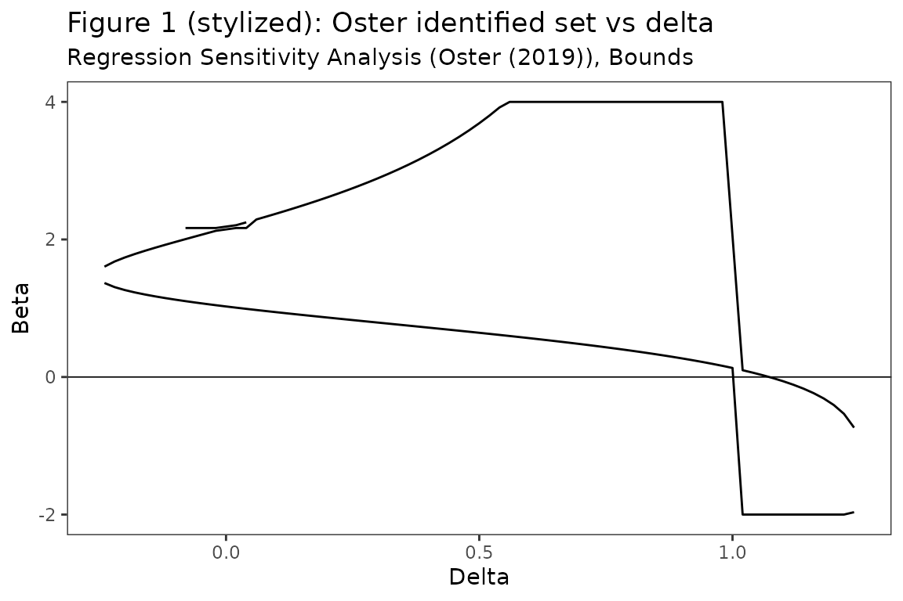
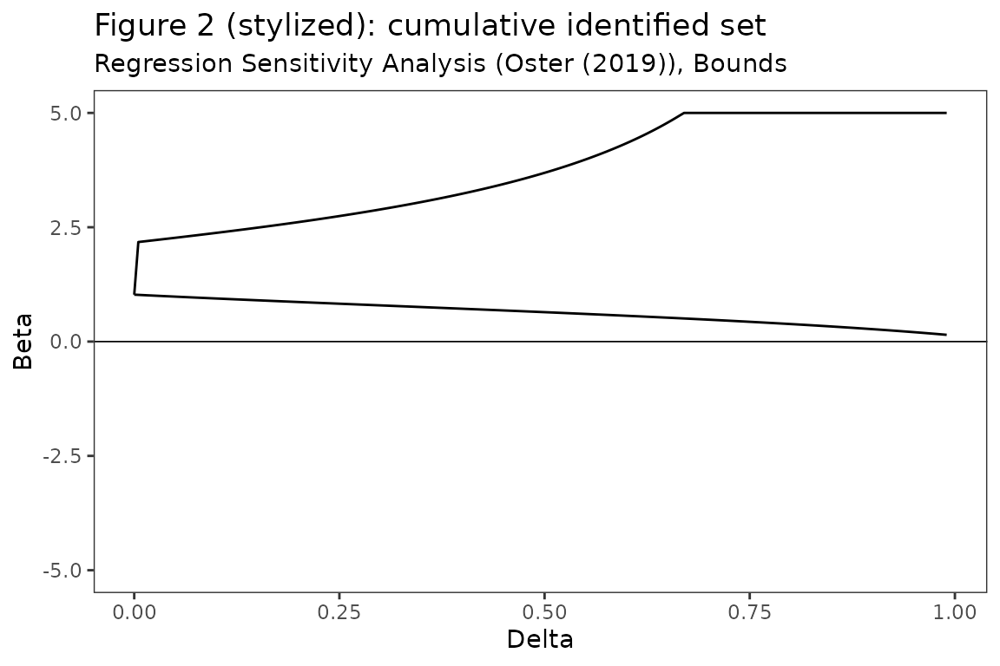
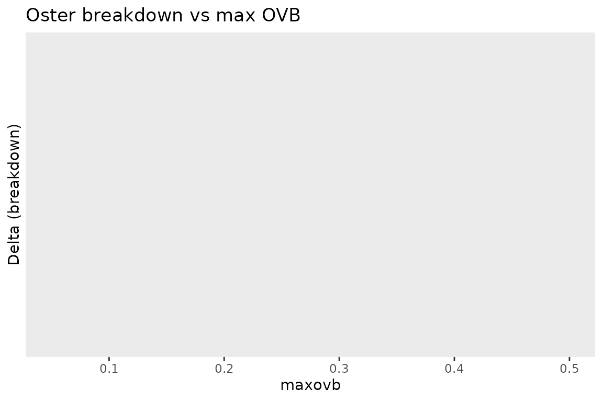

# Replication: Masten and Poirier (2026) stylized examples

This vignette reproduces the *stylized* figures of **Masten and Poirier
(2026),** [*The Effect of Omitted Variables on the Sign of Regression
Coefficients*](https://arxiv.org/abs/2208.00552). The remaining figures
and tables in that paper are meta-analyses across many published
studies; we illustrate the **methodology** using a constructed example
so that the machinery in `regsensitivity` is exercised end-to-end
without requiring copy-protected meta-analysis data.

## A stylized data-generating process

We construct a small example where the medium-regression coefficient is
positive but Oster’s identified set $`\mathcal{B}_I(\delta, R_{long})`$
crosses zero at moderate $`\delta`$.

``` r

library(regsensitivity)
library(ggplot2)

set.seed(2208)
n <- 5000
w1 <- rnorm(n)
w2 <- rnorm(n)
x  <- 0.3 * w1 + 0.5 * w2 + rnorm(n)
y  <- 0.8 * x + 0.4 * w1 + 0.6 * w2 + rnorm(n)
dat <- data.frame(y = y, x = x, w1 = w1)   # w2 is unobserved!

form <- y ~ x + w1
```

The “true” long-regression coefficient is 0.8; the medium regression
sees an upward-biased estimate because `w2` is correlated with `x`.

``` r

coef(lm(y ~ x + w1, data = dat))["x"]
#>        x 
#> 1.025787
```

## Figure 1: Oster’s identified set $`\mathcal{B}_I(\delta, R_{long})`$

``` r

res <- regsen_bounds(form, dat,
                      analysis = "oster",
                      delta = seq(-2, 2, 0.02),
                      r2long = 1)
plot(res, ylim = c(-2, 4),
     title = "Figure 1 (stylized): Oster identified set vs delta")
```



The branches of the cubic in $`\beta`$ that solve Oster’s equation give
the identified set. As $`\delta \to 1`$ from either side, the branches
diverge (asymptotes are roots of the cubic’s denominator).

## Figure 2: cumulative identified set $`\delta \le \bar d`$

``` r

res2 <- regsen_bounds(form, dat,
                       analysis = "oster",
                       delta = seq(0, 0.99, 0.005),
                       delta_type = "bound",
                       r2long = 1)
plot(res2, ylim = c(-5, 5),
     title = "Figure 2 (stylized): cumulative identified set")
```



## Table 1: breakdown points

| Quantity                                               | Value  |
|--------------------------------------------------------|--------|
| `oster_breakdown_eq`, $`\beta = 0`$, $`R_{long}=1`$    | 1.0725 |
| `oster_breakdown_bound`, $`\beta > 0`$, $`R_{long}=1`$ | 1      |
| DMP $`\bar r_X^{bp}`$ at $`\bar c = 1`$                | 0.9424 |

## Effect of a maxovb constraint

Masten-Poirier (2026) extend Oster by adding a **maximum omitted
variable bias** constraint. We illustrate by varying maxovb:

``` r

ovbs <- seq(0.05, 0.5, 0.05)
out <- lapply(ovbs, function(M) {
    r <- regsen_breakdown(form, dat,
                           analysis = "oster",
                           r2long = 1, maxovb = M)
    data.frame(maxovb = M, breakdown = r$results$breakdown[1])
})
out <- do.call(rbind, out)
ggplot(out, aes(maxovb, breakdown)) +
    geom_line() + geom_point() +
    labs(x = "maxovb", y = "Delta (breakdown)",
         title = "Oster breakdown vs max OVB")
```



A tighter cap on the OVB magnitude lifts the breakdown delta.

## Meta-analysis tables (paper Tables 2-4)

The paper’s Tables 2-4 aggregate breakdown-point statistics across many
published studies. The package contains the primitives needed to
reproduce those tables (`regsen_breakdown(... maxovb = ...)`); plug your
own meta-analysis data in and call:

``` r

results <- lapply(study_list, function(study) {
    out <- regsen_breakdown(study$formula, study$data,
                             analysis = "oster",
                             r2long = 1, maxovb = study$maxovb,
                             beta = bnd_eq(0))
    out$results$breakdown[1]
})
```
