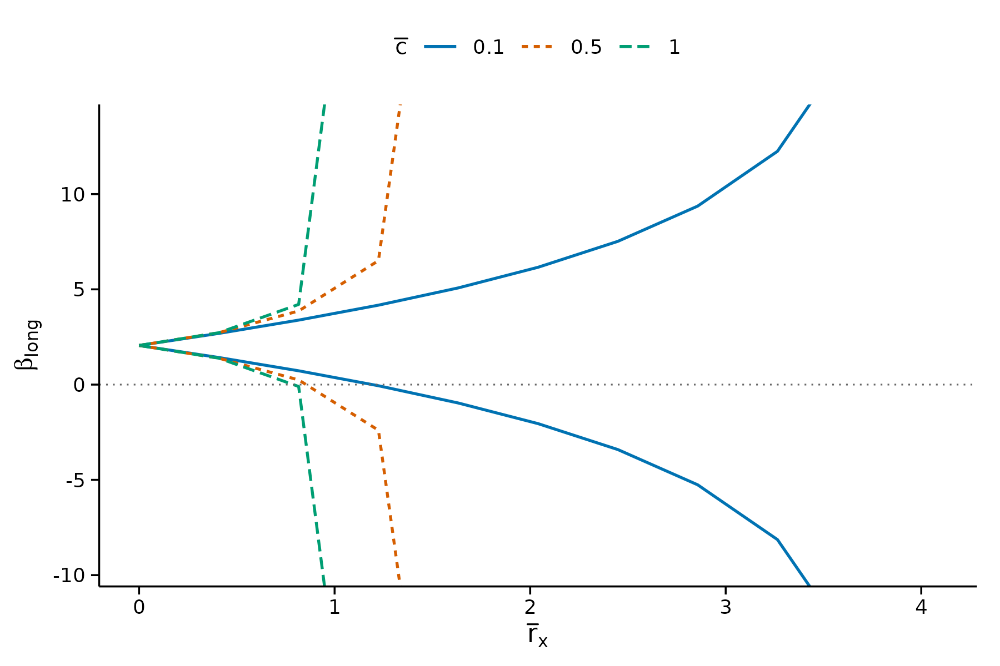
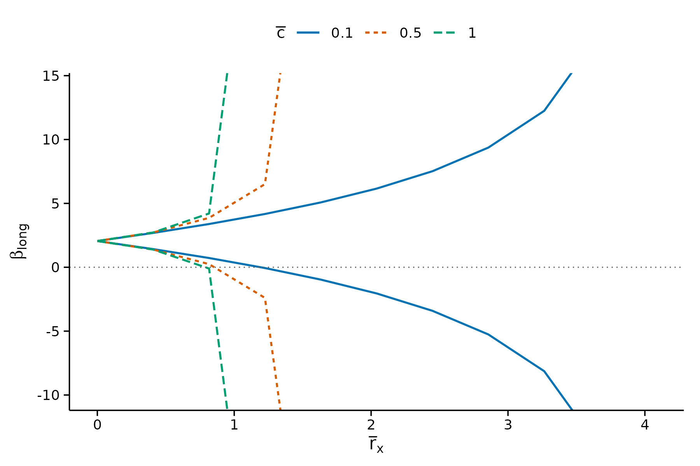
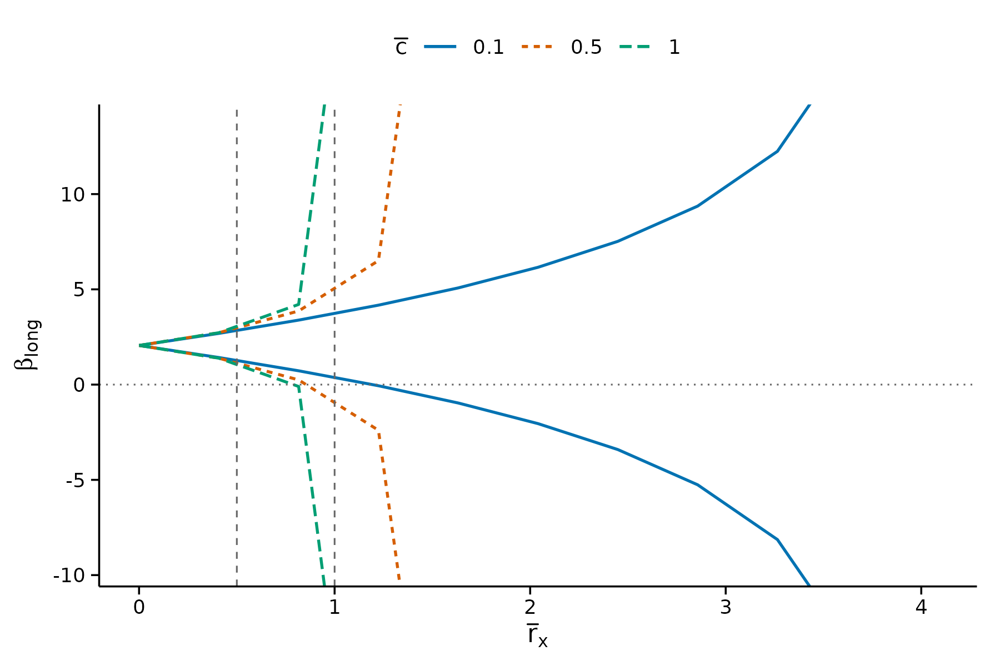
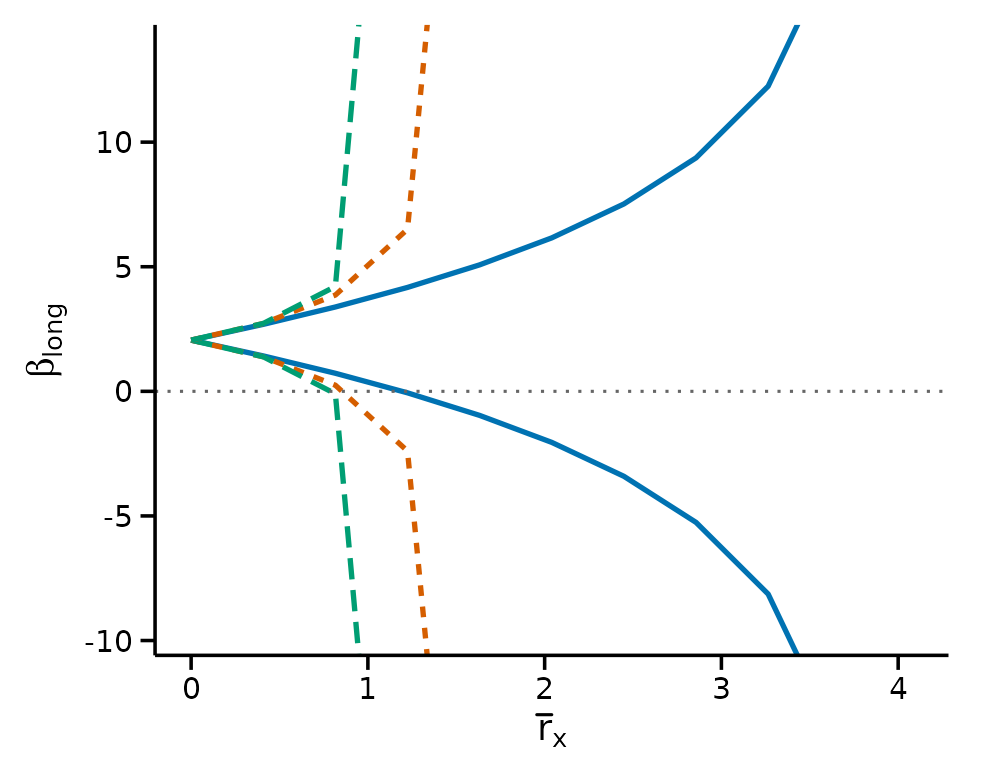
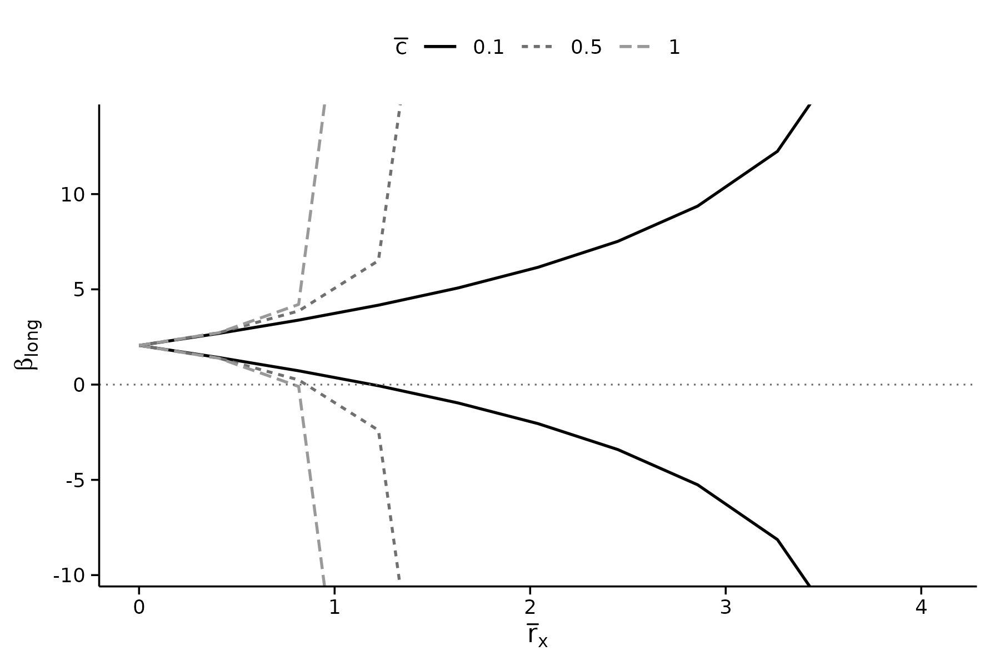
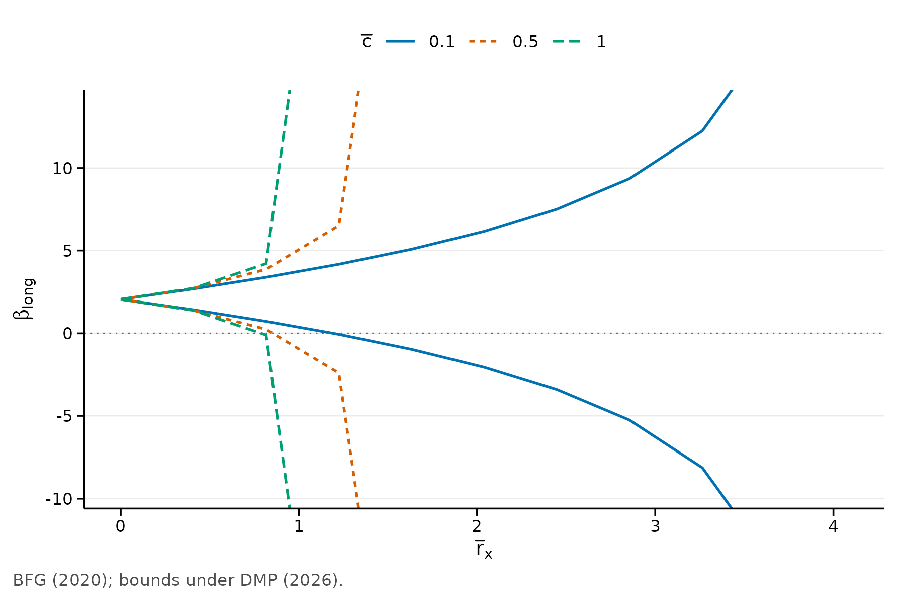

# Publication-ready plots and tables

Getting a sensitivity analysis into a paper means two things: a figure
that survives a journal’s production process, and a table in whatever
markup the manuscript is written in. This vignette covers both.

``` r

data(bfg2020)
bfg2020$statea <- factor(bfg2020$statea)
w1 <- c("log_area_2010", "lat", "lon", "temp_mean", "rain_mean",
        "elev_mean", "d_coa", "d_riv", "d_lak", "ave_gyi")
form <- avgrep2000to2016 ~ tye_tfe890_500kNI_100_l6 +
    log_area_2010 + lat + lon + temp_mean + rain_mean + elev_mean +
    d_coa + d_riv + d_lak + ave_gyi + statea

res <- regsen_bounds(form, bfg2020, compare = w1,
                      cbar = c(0.1, 0.5, 1))
```

## Figures

[`plot()`](https://rdrr.io/r/graphics/plot.default.html) returns an
ordinary `ggplot`, so nothing here is a dead end: anything the arguments
do not cover, you add yourself.

``` r

plot(res)
```



The defaults follow the economics journals: an L of axis lines rather
than a box, no grid, ticks outside the panel, and no title, because the
caption carries it.

### Reading an unbounded identified set

Where the identified set is unbounded, the bounds leave the panel rather
than tracing along its edge. That distinction matters: a line running
flat along the axis reads as “the bound levels off here”, which is the
opposite of what an infinite bound means.

``` r

plot(res, ylim = c(-10, 14))
```



The green and orange curves exit the top and bottom of the panel. They
do not plateau.

### Reference lines

`xline` is the equivalent of Stata’s `xline()`, for marking a threshold
under discussion in the text.

``` r

plot(res, xline = c(0.5, 1))
```



### Sizing for a journal

`base_size` scales the type. For a two-column figure, render at about
3.3 inches wide and pass `base_size = 9`, which puts the type near 8pt
on the page.

``` r

plot(res, base_size = 9, show_legend = FALSE)
```



### Matching your manuscript’s font

Fonts are left to you, because what is installed varies by machine and a
missing family would make the figure unreproducible. To match a LaTeX
body type:

``` r

plot(res) + theme_regsen(base_family = "Times New Roman")
```

### Colour, greyscale and accessibility

The palette is Okabe-Ito, which stays distinguishable under the common
forms of colour vision deficiency. Series are also encoded by line type,
so the figure still reads when a journal prints it in greyscale – colour
alone would not survive that.

``` r

plot(res) + scale_colour_grey(start = 0, end = 0.6)
#> Scale for colour is already present.
#> Adding another scale for colour, which will replace the existing scale.
```



### Overriding anything

``` r

plot(res, subtitle = NA) +
    theme_regsen(grid = "y", base_size = 10) +
    labs(caption = "BFG (2020); bounds under DMP (2026).")
```



## Tables

### The tidy route

[`as.data.frame()`](https://rdrr.io/r/base/as.data.frame.html) gives the
results as a plain data frame. This is the recommended entry point: it
hands the numbers to whichever table package you already use, rather
than tying the package to one of them.

``` r

head(as.data.frame(res, digits = 3))
#>   rxbar rybar cbar    bmin bmax
#> 1 0.000   Inf  0.1  2.0500 2.05
#> 2 0.408   Inf  0.1  1.4200 2.69
#> 3 0.816   Inf  0.1  0.7240 3.39
#> 4 1.220   Inf  0.1 -0.0602 4.17
#> 5 1.630   Inf  0.1 -0.9660 5.08
#> 6 2.040   Inf  0.1 -2.0500 6.16
```

From here `kableExtra`, `gt`, `modelsummary`, `huxtable`, `tinytable`
and `xtable` all work as usual.

### The convenience route

[`regsen_table()`](https://mikenguyen13.github.io/regsensitivity/reference/regsen_table.md)
covers the common case in one call. The `format` argument follows the
document you are knitting to, so the same chunk works whether the target
is PDF, HTML or Markdown.

``` r

regsen_table(res, format = "markdown", digits = 3, max_rows = 6)
```

| rxbar | rybar |  cbar | Lower | Upper |
|------:|------:|------:|------:|------:|
|     0 |  +Inf | 0.100 |  2.05 |  2.05 |
|  2.45 |  +Inf | 0.100 | -3.41 |  7.52 |
| 0.816 |  +Inf | 0.500 | 0.245 |  3.86 |
|  3.26 |  +Inf | 0.500 |  -Inf |  +Inf |
|  1.63 |  +Inf |  1.00 |  -Inf |  +Inf |
|  4.08 |  +Inf |  1.00 |  -Inf |  +Inf |

### LaTeX for a journal

The LaTeX flavour follows the economics convention: `booktabs` rules and
notes inside a `threeparttable`, so the note block sets to the width of
the table rather than the width of the page.

``` r

cat(regsen_table(res, format = "latex", digits = 3, max_rows = 4,
                  caption = "Identified sets for the long-regression coefficient",
                  label = "idset", notes = TRUE, escape = FALSE),
    sep = "\n")
```

`notes = TRUE` writes the note a referee looks for – which analysis,
which hypothesis, how many observations. Supply a character vector
instead to write your own.

Using it in a manuscript needs one line in the preamble:

``` latex
\usepackage{booktabs}
\usepackage{threeparttable}
```

Set `threeparttable = FALSE` if you would rather not, and the notes are
appended as plain `\footnotesize` lines.

### Infinite bounds

An unbounded identified set is a result, not missing data, so it is
rendered rather than blanked: `$+\infty$` in LaTeX, the infinity
character in HTML, `+Inf` in Markdown.

``` r

regsen_table(res, format = "markdown", digits = 3, max_rows = 8)
```

| rxbar | rybar |  cbar | Lower | Upper |
|------:|------:|------:|------:|------:|
|     0 |  +Inf | 0.100 |  2.05 |  2.05 |
|  2.04 |  +Inf | 0.100 | -2.05 |  6.16 |
|  3.67 |  +Inf | 0.100 | -14.2 |  18.3 |
|  1.22 |  +Inf | 0.500 | -2.40 |  6.51 |
|  2.86 |  +Inf | 0.500 |  -Inf |  +Inf |
| 0.408 |  +Inf |  1.00 |  1.39 |  2.72 |
|  2.04 |  +Inf |  1.00 |  -Inf |  +Inf |
|  4.08 |  +Inf |  1.00 |  -Inf |  +Inf |

### Feeding modelsummary

[`regsen_tidy()`](https://mikenguyen13.github.io/regsensitivity/reference/regsen_tidy.md)
and
[`regsen_glance()`](https://mikenguyen13.github.io/regsensitivity/reference/regsen_tidy.md)
speak broom’s vocabulary, so results flow into `modelsummary` and
anything else built on it. When is installed these are also reachable as
`tidy()` and `glance()`.

``` r

head(regsen_tidy(res), 4)
#>                       term estimate    conf.low conf.high     rxbar rybar cbar
#> 1 tye_tfe890_500kNI_100_l6 2.054759  2.05475946  2.054759 0.0000000   Inf  0.1
#> 2 tye_tfe890_500kNI_100_l6 2.054759  1.42206743  2.687451 0.4080674   Inf  0.1
#> 3 tye_tfe890_500kNI_100_l6 2.054759  0.72444299  3.385076 0.8161347   Inf  0.1
#> 4 tye_tfe890_500kNI_100_l6 2.054759 -0.06022714  4.169746 1.2242021   Inf  0.1
regsen_glance(res)
#>     analysis subcommand          outcome                treatment nobs
#> 1 DMP (2026)     bounds avgrep2000to2016 tye_tfe890_500kNI_100_l6 2036
#>   beta_medium breakdown hypothesis n_gridpoints
#> 1    2.054759        NA   Beta > 0           33
```

`estimate` is the medium-regression coefficient, never a function of the
bounds. Under DMP with `rybar = Inf` the identified set is symmetric
about that coefficient, so a midpoint would agree here and then diverge
for Oster or finite `rybar` – and it is undefined wherever the set is
unbounded.

    #> R version 4.6.1 (2026-06-24)
    #> Platform: x86_64-pc-linux-gnu
    #> Running under: Ubuntu 24.04.4 LTS
    #> 
    #> Matrix products: default
    #> BLAS:   /usr/lib/x86_64-linux-gnu/openblas-pthread/libblas.so.3 
    #> LAPACK: /usr/lib/x86_64-linux-gnu/openblas-pthread/libopenblasp-r0.3.26.so;  LAPACK version 3.12.0
    #> 
    #> locale:
    #>  [1] LC_CTYPE=C.UTF-8       LC_NUMERIC=C           LC_TIME=C.UTF-8       
    #>  [4] LC_COLLATE=C.UTF-8     LC_MONETARY=C.UTF-8    LC_MESSAGES=C.UTF-8   
    #>  [7] LC_PAPER=C.UTF-8       LC_NAME=C              LC_ADDRESS=C          
    #> [10] LC_TELEPHONE=C         LC_MEASUREMENT=C.UTF-8 LC_IDENTIFICATION=C   
    #> 
    #> time zone: UTC
    #> tzcode source: system (glibc)
    #> 
    #> attached base packages:
    #> [1] stats     graphics  grDevices utils     datasets  methods   base     
    #> 
    #> other attached packages:
    #> [1] ggplot2_4.0.3        regsensitivity_0.1.1
    #> 
    #> loaded via a namespace (and not attached):
    #>  [1] vctrs_0.7.3        cli_3.6.6          knitr_1.51         rlang_1.3.0       
    #>  [5] xfun_0.60          otel_0.2.0         generics_0.1.4     S7_0.2.2          
    #>  [9] textshaping_1.0.5  jsonlite_2.0.0     labeling_0.4.3     glue_1.8.1        
    #> [13] htmltools_0.5.9    ragg_1.5.2         sass_0.4.10        scales_1.4.0      
    #> [17] rmarkdown_2.31     grid_4.6.1         evaluate_1.0.5     jquerylib_0.1.4   
    #> [21] fastmap_1.2.0      yaml_2.3.12        lifecycle_1.0.5    compiler_4.6.1    
    #> [25] RColorBrewer_1.1-3 fs_2.1.0           farver_2.1.2       systemfonts_1.3.2 
    #> [29] digest_0.6.39      R6_2.6.1           bslib_0.12.0       withr_3.0.3       
    #> [33] tools_4.6.1        gtable_0.3.6       pkgdown_2.2.1      cachem_1.1.0      
    #> [37] desc_1.4.3
