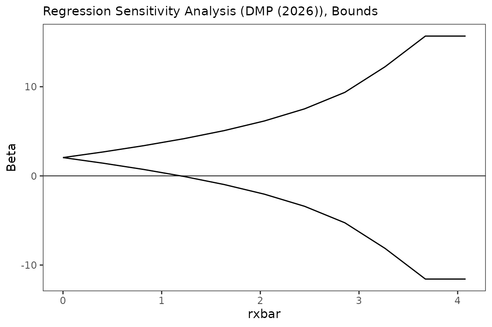
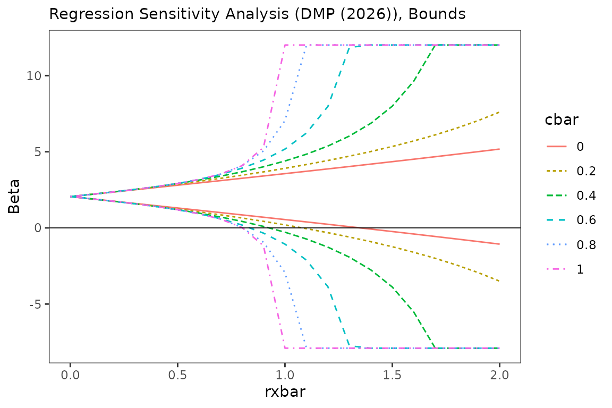
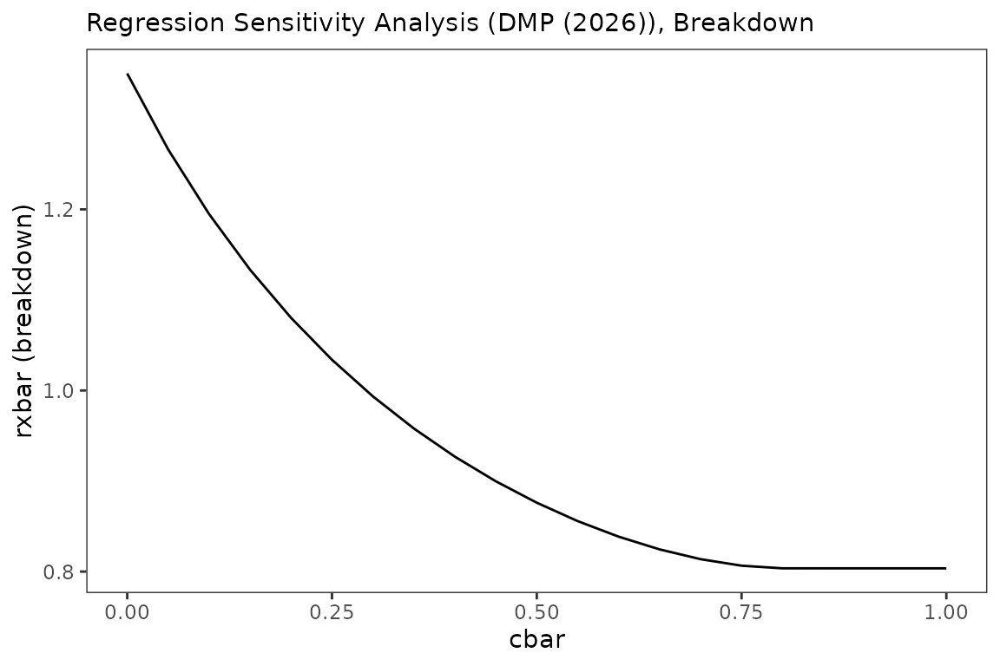
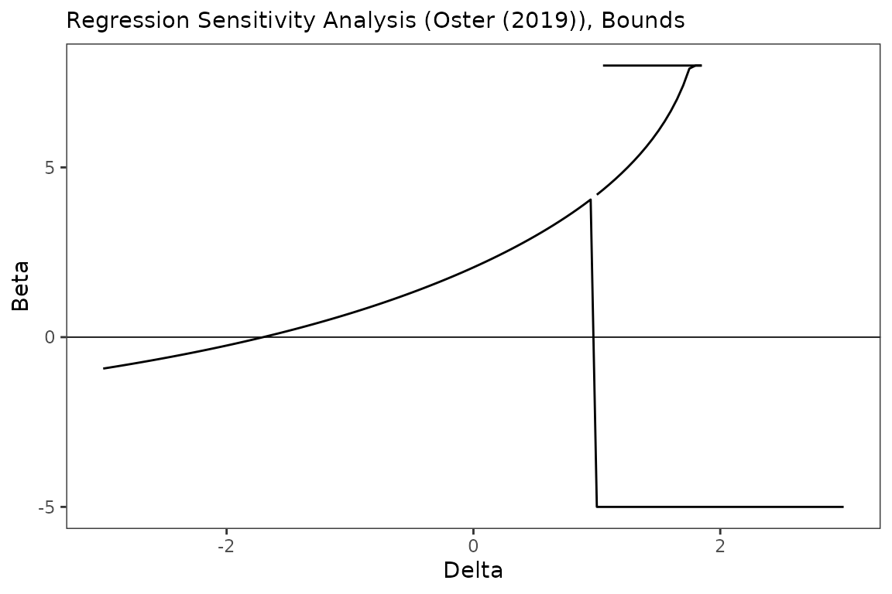
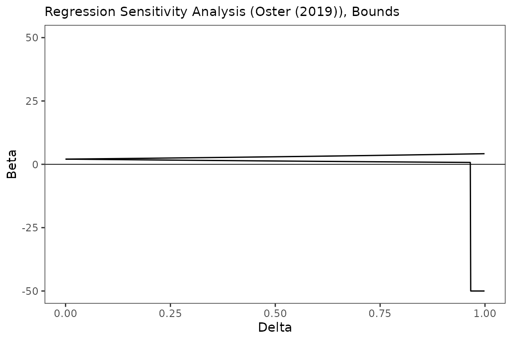
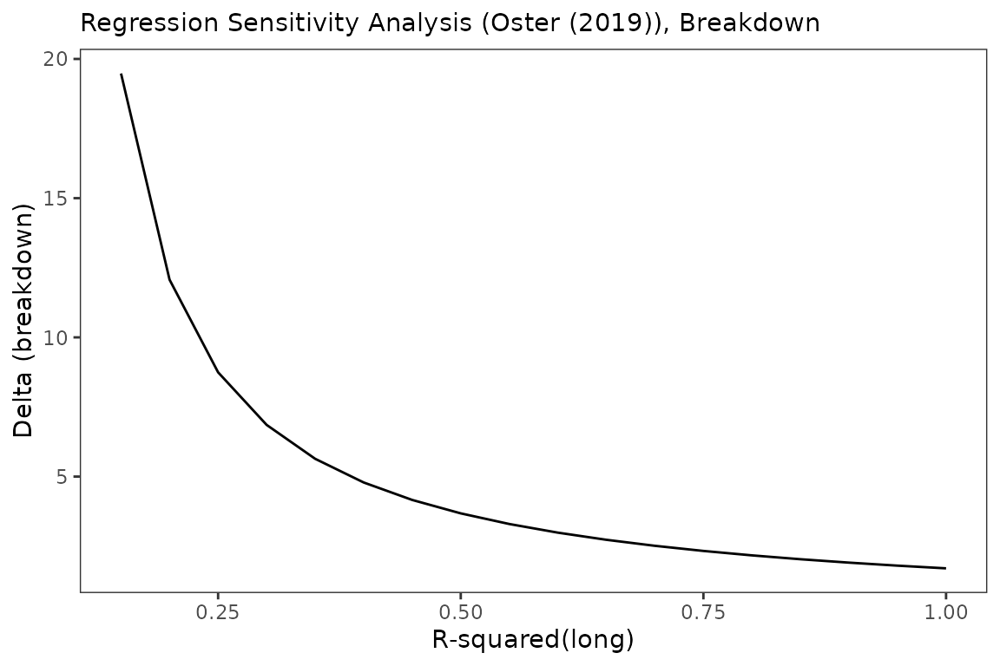
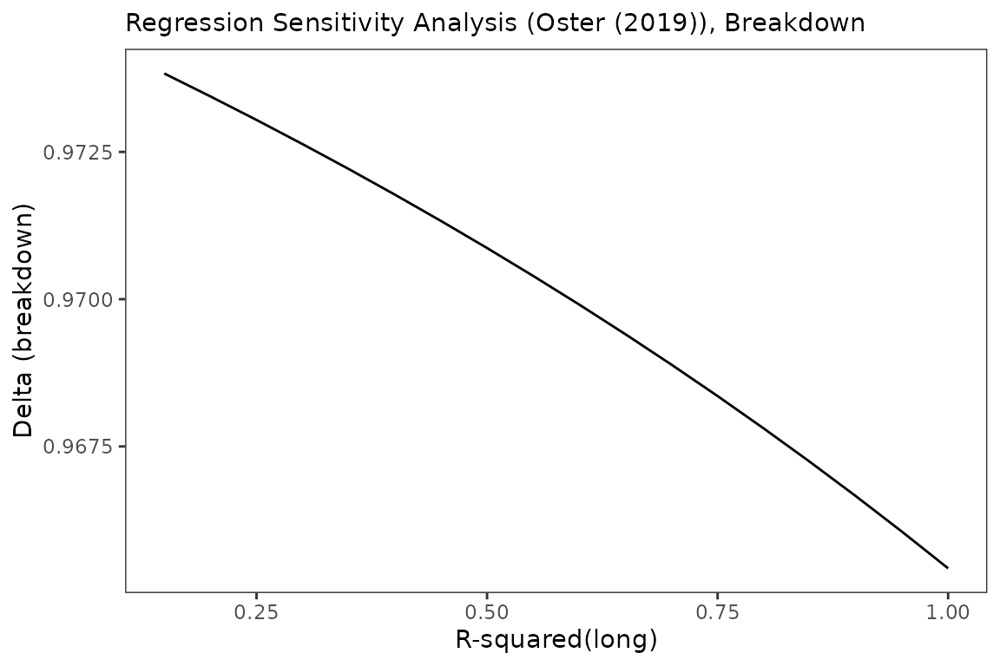

# regsensitivity: a tour

This vignette replicates the BFG2020 empirical application used in the
Stata `regsensitivity` vignette, walking through the
**Diegert-Masten-Poirier (2026)** and **Oster (2019) / Masten-Poirier
(2026)** analyses.

``` r

library(regsensitivity)
library(ggplot2)
data(bfg2020)
bfg2020$statea <- factor(bfg2020$statea)

controls <- c("log_area_2010", "lat", "lon", "temp_mean", "rain_mean",
              "elev_mean", "d_coa", "d_riv", "d_lak", "ave_gyi", "statea")
form <- avgrep2000to2016 ~ tye_tfe890_500kNI_100_l6 +
    log_area_2010 + lat + lon + temp_mean + rain_mean + elev_mean +
    d_coa + d_riv + d_lak + ave_gyi + statea
compare <- setdiff(controls, "statea")
```

The “short” regression coefficient (with no controls) and the “medium”
regression coefficient (with state FE and the comparison controls) give
a first sense of how much controls move the estimate:

``` r

short <- lm(avgrep2000to2016 ~ tye_tfe890_500kNI_100_l6, data = bfg2020)
med   <- lm(form, data = bfg2020)
coef(short)[2]
#> tye_tfe890_500kNI_100_l6 
#>                 1.707838
coef(med)["tye_tfe890_500kNI_100_l6"]
#> tye_tfe890_500kNI_100_l6 
#>                 2.054759
```

## DMP (2026) bounds

[`regsen_bounds()`](../reference/regsen_bounds.md) is the workhorse. Out
of the box it sweeps over a grid of `rxbar` from 0 to the threshold
where the identified set first becomes $`(-\infty,+\infty)`$, holding
`cbar` fixed at the supplied value.

``` r

bnds <- regsen_bounds(form, bfg2020, compare = compare, cbar = 0.1)
print(bnds)
#> 
#> Regression Sensitivity Analysis ----- Bounds
#> ------------------------------------------------------------------------
#> Analysis:          DMP (2026)
#> Treatment:         tye_tfe890_500kNI_100_l6
#> Outcome:           avgrep2000to2016
#> N (obs):           2036
#> Hypothesis:        Beta > 0
#> Breakdown point:   1.1947
#> 
#> --- Summary statistics ----------------------------------
#>   Beta (short)                  1.9246
#>   Beta (medium)                 2.0548
#>   R2 (short)                    0.0328
#>   R2 (medium)                   0.1051
#>   Var(Y)                      101.7387
#>   Var(X)                        0.9014
#>   Var(X_Residual)               0.8823
#> 
#> --- Results ---------------------------------------------
#>    rxbar rybar   cbar      bmin   bmax
#>        0  +Inf    0.1    2.0548 2.0548
#>  0.40807  +Inf    0.1    1.4221 2.6875
#>  0.81613  +Inf    0.1   0.72444 3.3851
#>   1.2242  +Inf    0.1 -0.060227 4.1697
#>   1.6323  +Inf    0.1  -0.96596 5.0755
#>   2.0403  +Inf    0.1   -2.0488 6.1583
#>   2.4484  +Inf    0.1   -3.4099 7.5195
#>   2.8565  +Inf    0.1   -5.2589 9.3684
#>   3.2645  +Inf    0.1   -8.1355 12.245
#>   3.6726  +Inf    0.1   -14.208 18.317
#>   4.0807  +Inf    0.1      -Inf   +Inf
```

The bounds widen monotonically as `rxbar` (the strength of the
unobservable’s effect on the treatment) grows. The breakdown point
reported in the header is the `rxbar` value at which the hypothesis
($`\beta>0`$, in this case) first fails.

``` r

plot(bnds)
```



Sweeping over multiple `cbar` values lets you see how stronger
correlations between the comparison controls and the unobservable affect
the bounds:

``` r

multi <- regsen_bounds(form, bfg2020, compare = compare,
                        rxbar = seq(0, 2, length.out = 21),
                        cbar = c(0, 0.2, 0.4, 0.6, 0.8, 1.0))
plot(multi)
```



### Constrained `rybar`

Setting `rybar` to a finite value adds a constraint on the
unobservable’s effect on the outcome. When `cbar > 0` this is a
nonconvex problem and we solve it with a global optimizer (`nloptr` /
DIRECT-L); when `cbar = 0` it has a closed form. Both cases run through
the same [`regsen_bounds()`](../reference/regsen_bounds.md) call:

``` r

fin <- regsen_bounds(form, bfg2020, compare = compare, rybar = 2)
print(fin)
#> 
#> Regression Sensitivity Analysis ----- Bounds
#> ------------------------------------------------------------------------
#> Analysis:          DMP (2026)
#> Treatment:         tye_tfe890_500kNI_100_l6
#> Outcome:           avgrep2000to2016
#> N (obs):           2036
#> Hypothesis:        Beta > 0
#> Breakdown point:   0.8036
#> 
#> --- Summary statistics ----------------------------------
#>   Beta (short)                  1.9246
#>   Beta (medium)                 2.0548
#>   R2 (short)                    0.0328
#>   R2 (medium)                   0.1051
#>   Var(Y)                      101.7387
#>   Var(X)                        0.9014
#>   Var(X_Residual)               0.8823
#> 
#> --- Results ---------------------------------------------
#>     rxbar  rybar   cbar     bmin   bmax
#>         0      2      1   2.0548 2.0548
#>  0.098939      2      1    1.912 2.1986
#>   0.19788      2      1   1.7623 2.3522
#>   0.29682      2      1   1.5985 2.5182
#>   0.39576      2      1    1.416 2.6989
#>   0.49469      2      1   1.2031 2.9068
#>   0.59363      2      1   0.9512 3.1616
#>   0.69257      2      1  0.60818 3.5013
#>   0.79151      2      1 0.087004 4.0225
#>   0.89045      2      1 -0.99231 5.1018
#>   0.98939      2      1     -Inf   +Inf
```

You can also express `rybar` as a function of `rxbar`,
e.g. `rybar = rxbar`:

``` r

expr <- regsen_bounds(form, bfg2020, compare = compare,
                       rybar_expr = function(rx) rx,
                       rxbar = seq(0, 1, 0.1))
expr$results
#>    rxbar rybar cbar     bmin     bmax
#> 1    0.0   0.0    1 2.054759 2.054759
#> 2    0.1   0.1    1 2.050500 2.059032
#> 3    0.2   0.2    1 2.037543 2.072209
#> 4    0.3   0.3    1 2.015280 2.095471
#> 5    0.4   0.4    1 1.982468 2.131282
#> 6    0.5   0.5    1 1.936656 2.184482
#> 7    0.6   0.6    1 1.872609 2.265132
#> 8    0.7   0.7    1 1.778092 2.397429
#> 9    0.8   0.8    1 1.616690 2.656058
#> 10   0.9   0.9    1 1.189357 3.438213
#> 11   1.0   1.0    1     -Inf      Inf
```

## DMP breakdown

[`regsen_breakdown()`](../reference/regsen_breakdown.md) reports the
breakdown point as a function of one of the sensitivity parameters,
holding the others fixed:

``` r

bd <- regsen_breakdown(form, bfg2020, compare = compare,
                        cbar = seq(0, 1, 0.05))
plot(bd)
```



You can also sweep across hypothesis values:

``` r

hyp <- regsen_breakdown(form, bfg2020, compare = compare,
                         beta = bnd_lb(seq(-1, 1, 0.2)))
print(hyp)
#> 
#> Regression Sensitivity Analysis ----- Breakdown Frontier
#> ------------------------------------------------------------------------
#> Analysis:          DMP (2026)
#> Treatment:         tye_tfe890_500kNI_100_l6
#> Outcome:           avgrep2000to2016
#> N (obs):           2036
#> Hypothesis:        Beta > Beta(Hypothesis)
#> 
#> --- Summary statistics ----------------------------------
#>   Beta (short)                  1.9246
#>   Beta (medium)                 2.0548
#>   R2 (short)                    0.0328
#>   R2 (medium)                   0.1051
#>   Var(Y)                      101.7387
#>   Var(X)                        0.9014
#>   Var(X_Residual)               0.8823
#> 
#> --- Results ---------------------------------------------
#>   index breakdown
#>      -1   0.89085
#>    -0.8   0.87887
#>    -0.6   0.86473
#>    -0.4   0.84792
#>    -0.2    0.8278
#>       0   0.80356
#>     0.2   0.77418
#>     0.4   0.73835
#>     0.6   0.69452
#>     0.8   0.64083
#>       1   0.57525
```

## Oster (2019) bounds

Switching to the Oster analysis with `analysis = "oster"`:

``` r

o <- regsen_bounds(form, bfg2020, compare = compare,
                    analysis = "oster")
print(o)
#> 
#> Regression Sensitivity Analysis ----- Bounds
#> ------------------------------------------------------------------------
#> Analysis:          Oster (2019)
#> Treatment:         tye_tfe890_500kNI_100_l6
#> Outcome:           avgrep2000to2016
#> N (obs):           2036
#> Hypothesis:        Beta > 0
#> Breakdown point:   1.7039
#> 
#> --- Summary statistics ----------------------------------
#>   Beta (short)                  1.9246
#>   Beta (medium)                 2.0548
#>   R2 (short)                    0.0328
#>   R2 (medium)                   0.1051
#>   Var(Y)                      101.7387
#>   Var(X)                        0.9014
#>   Var(X_Residual)               0.8823
#> 
#> --- Results ---------------------------------------------
#>   delta r2long   beta1  beta2 beta3
#>      -1      1 0.69842             
#>    -0.8      1 0.93048             
#>    -0.6      1  1.1801             
#>    -0.4      1   1.449             
#>    -0.2      1  1.7396             
#>       0      1  2.0548             
#>     0.2      1  2.3981             
#>     0.4      1  2.7747             
#>     0.6      1  3.1917             
#>     0.8      1  3.6595             
#>       1      1 -46.171 4.1944
```

Plotting the equality identified set (rotated so that delta is on the
x-axis and beta on the y-axis):

``` r

o2 <- regsen_bounds(form, bfg2020, compare = compare,
                     analysis = "oster",
                     delta = seq(-3, 3, 0.05))
plot(o2, ylim = c(-5, 8))
```



### Oster, \|delta\| \<= d (bound)

``` r

ob <- regsen_bounds(form, bfg2020, compare = compare,
                     analysis = "oster",
                     delta = seq(0, 0.999, 0.001),
                     delta_type = "bound")
plot(ob, ylim = c(-50, 50))
```



## Oster breakdown

``` r

obd_eq <- regsen_breakdown(form, bfg2020, compare = compare,
                            analysis = "oster",
                            r2long = seq(0.15, 1, 0.05),
                            beta = bnd_eq(0))
plot(obd_eq)
```



``` r


obd_sign <- regsen_breakdown(form, bfg2020, compare = compare,
                              analysis = "oster",
                              r2long = seq(0.15, 1, 0.05))
plot(obd_sign)
```



## Summary call

When you don’t know where to start,
[`regsen_summary()`](../reference/regsen_summary.md) runs the default
DMP bounds analysis plus an Oster breakdown sweep at a few standard
`r2long` values, matching the behaviour of Stata’s `regsensitivity` with
no subcommand.

``` r

s <- regsen_summary(form, bfg2020, compare = compare)
print(s)
#> 
#> === DMP (2026) bounds ===
#> 
#> Regression Sensitivity Analysis ----- Bounds
#> ------------------------------------------------------------------------
#> Analysis:          DMP (2026)
#> Treatment:         tye_tfe890_500kNI_100_l6
#> Outcome:           avgrep2000to2016
#> N (obs):           2036
#> Hypothesis:        Beta > 0
#> Breakdown point:   0.8036
#> 
#> --- Summary statistics ----------------------------------
#>   Beta (short)                  1.9246
#>   Beta (medium)                 2.0548
#>   R2 (short)                    0.0328
#>   R2 (medium)                   0.1051
#>   Var(Y)                      101.7387
#>   Var(X)                        0.9014
#>   Var(X_Residual)               0.8823
#> 
#> --- Results ---------------------------------------------
#>     rxbar rybar   cbar     bmin   bmax
#>         0  +Inf      1   2.0548 2.0548
#>  0.098939  +Inf      1   1.9064 2.2031
#>   0.19788  +Inf      1   1.7535  2.356
#>   0.29682  +Inf      1   1.5906 2.5189
#>   0.39576  +Inf      1   1.4106 2.6989
#>   0.49469  +Inf      1   1.2026 2.9069
#>   0.59363  +Inf      1  0.94779 3.1617
#>   0.69257  +Inf      1  0.60803 3.5015
#>   0.79151  +Inf      1 0.086812 4.0227
#>   0.89045  +Inf      1 -0.99272 5.1022
#>   0.98939  +Inf      1     -Inf   +Inf
#> 
#> === Oster (2019) breakdown ===
#> 
#> Regression Sensitivity Analysis ----- Breakdown Frontier
#> ------------------------------------------------------------------------
#> Analysis:          Oster (2019)
#> Treatment:         tye_tfe890_500kNI_100_l6
#> Outcome:           avgrep2000to2016
#> N (obs):           2036
#> Hypothesis:        Beta > 0
#> 
#> --- Summary statistics ----------------------------------
#>   Beta (short)                  1.9246
#>   Beta (medium)                 2.0548
#>   R2 (short)                    0.0328
#>   R2 (medium)                   0.1051
#>   Var(Y)                      101.7387
#>   Var(X)                        0.9014
#>   Var(X_Residual)               0.8823
#> 
#> --- Results ---------------------------------------------
#>    index breakdown
#>  0.13667   0.97393
#>  0.23667   0.97315
#>  0.33667   0.97232
#>  0.43667   0.97145
#>  0.53667   0.97052
#>  0.63667   0.96954
#>  0.73667    0.9685
#>  0.83667   0.96739
#>  0.93667   0.96622
#>        1   0.96543
```

## References

- Diegert, P., Masten, M., and Poirier, A. (2026). Assessing Omitted
  Variable Bias when the Controls are Endogenous. arXiv:2206.02303.
- Oster, E. (2019). Unobservable Selection and Coefficient Stability:
  Theory and Evidence. *JBES* 37(2), 187–204.
- Masten, M., and Poirier, A. (2026). The Effect of Omitted Variables on
  the Sign of Regression Coefficients. arXiv:2208.00552.
- Bazzi, S., Fiszbein, M., and Gebresilasse, M. (2020). Frontier
  Culture: The Roots and Persistence of “Rugged Individualism” in the
  United States. *Econometrica* 88(6), 2329–2368.
