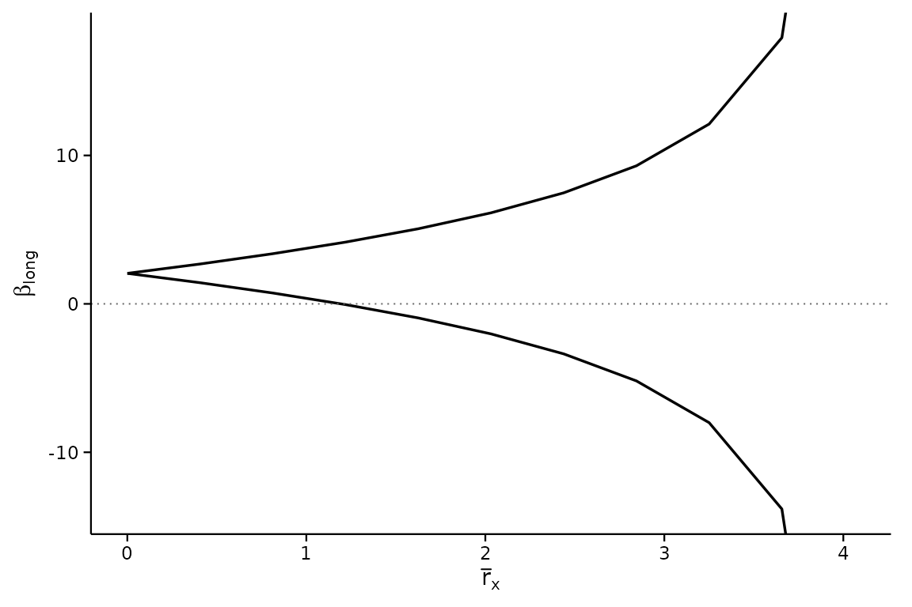
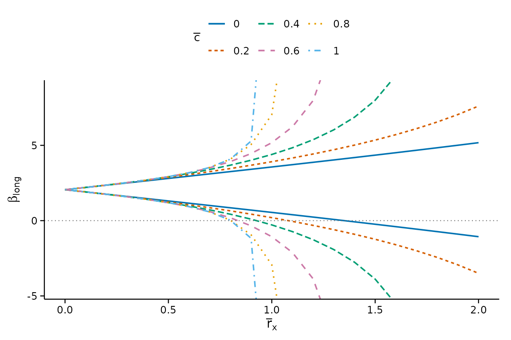
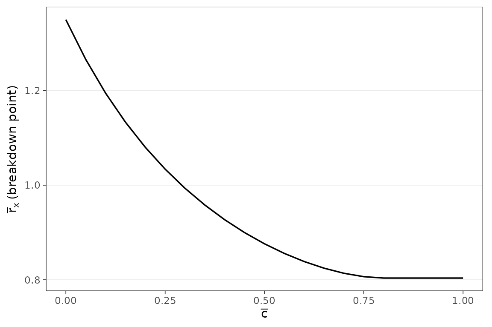
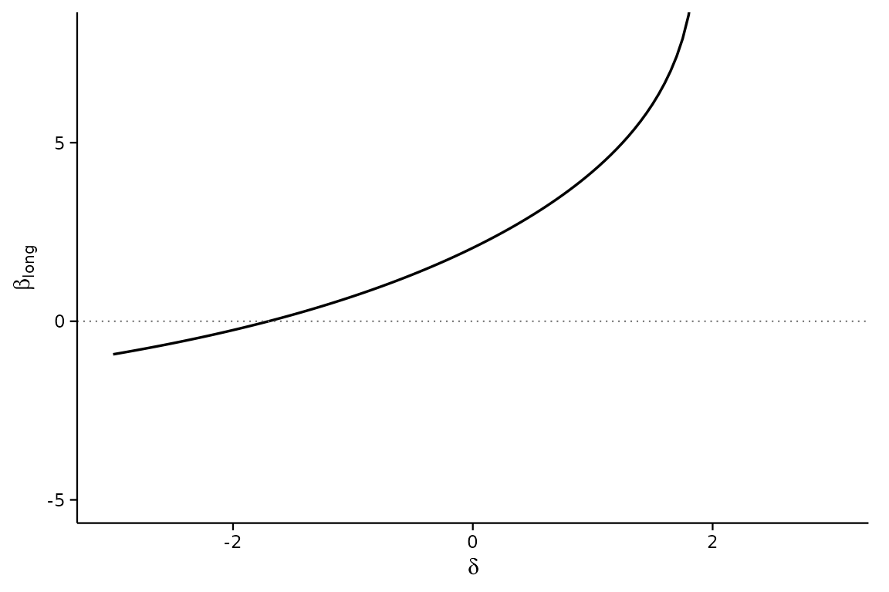
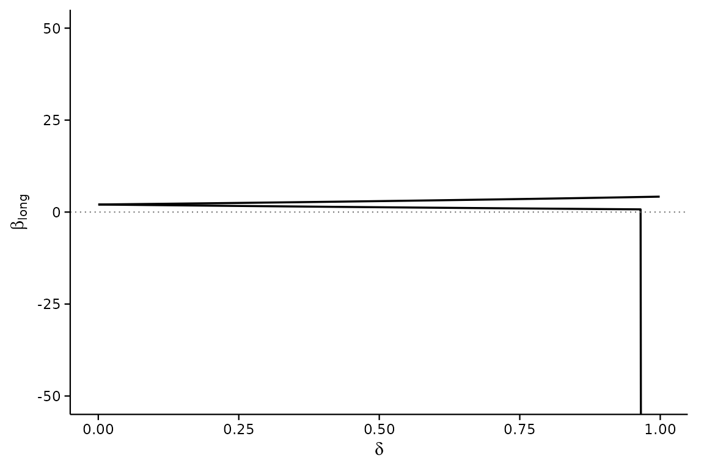
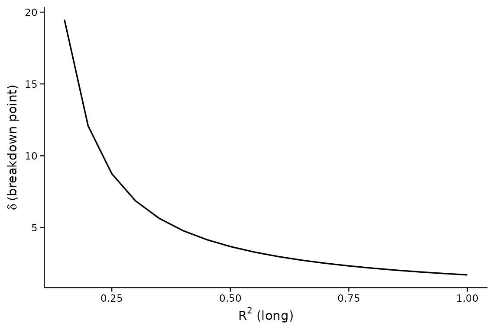
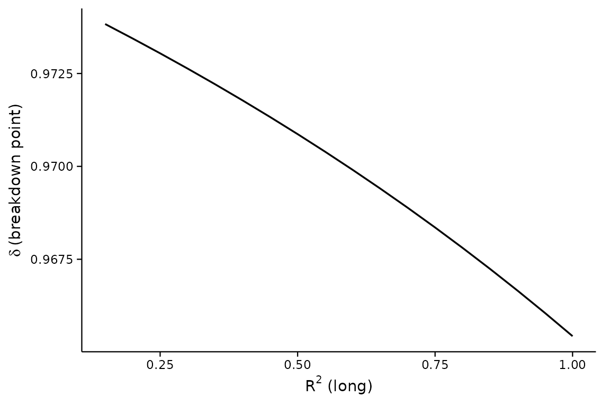

# regsensitivity: a tour

This vignette replicates the BFG2020 empirical application used in the
Stata `regsensitivity` vignette, walking through the
**Diegert-Masten-Poirier (2026)** and **Oster (2019) / Masten-Poirier
(2026)** analyses. It shows how to call the package; for what the
numbers mean, what to conclude from them and what to write in a paper,
see
[`vignette("interpreting-results")`](https://mikenguyen13.github.io/regsensitivity/articles/interpreting-results.md).

## The setup

Every analysis in this package concerns the same picture.


You want $`\beta_{\text{long}}`$, the coefficient on the treatment $`X`$
in a regression that adjusts for *everything* relevant, observed or not.
You can only run the *medium* regression, which adjusts for the observed
covariates and returns $`\beta_{\text{med}}`$. The two agree exactly
when $`\pi_2 = 0`$: no selection on unobservables, the dashed arrow into
$`X`$ erased. Sensitivity analysis asks how far that can fail before
your conclusion does.

Note what the baseline does *not* assume. It leaves $`\gamma_2`$ free –
the unobservable may matter arbitrarily much for the outcome – and it
leaves the $`W_1`$–$`W_2`$ association free. That is why the observed
controls being endogenous is not, on its own, fatal.

The observed covariates split in two. The ones you name in `compare` are
the **calibration** covariates $`W_1`$: the yardstick the unobservable
is measured against. Everything else is a **control** covariate $`W_0`$,
adjusted for but never used as a yardstick – fixed effects and nuisance
controls belong here. (Stata’s `regsensitivity` and this package’s
argument names call $`W_1`$ the *comparison set*, which is where
`compare` gets its name; the DMP paper calls it the calibration set.
They are the same thing.)

``` r

library(regsensitivity)
library(ggplot2)
data(bfg2020)
bfg2020$statea <- factor(bfg2020$statea)

form <- avgrep2000to2016 ~ tye_tfe890_500kNI_100_l6 +
    log_area_2010 + lat + lon + temp_mean + rain_mean + elev_mean +
    d_coa + d_riv + d_lak + ave_gyi + statea
compare <- c("log_area_2010", "lat", "lon", "temp_mean", "rain_mean",
             "elev_mean", "d_coa", "d_riv", "d_lak", "ave_gyi")
```

So here the geographic and climate variables are $`W_1`$ and the state
fixed effects `statea` are $`W_0`$: the omitted variable’s importance is
judged against geography and climate, never against state dummies. In
general:


`nocompare` draws the same line from the other side, naming $`W_0`$
instead; give at most one of the two. If you give neither, every control
enters $`W_1`$.

## The three sensitivity parameters

Rather than assume $`\pi_2 = 0`$, DMP bound how large the unobservable’s
role can be. Three parameters do the work, and each caps one feature of
the picture above:


- `rxbar` bounds $`r_X`$: how much the unobservable moves the
  **treatment**, as a multiple of how much the calibration covariates
  do. `rxbar = 1` says the unobservable is at most as important as
  $`W_1`$ taken together.
- `rybar` bounds $`r_Y`$: the same ratio for the **outcome**. Left at
  `Inf` by default, which assumes nothing about $`\gamma_2`$.
- `cbar` and `clow` bound how much of the unobservable the calibration
  covariates already explain. The default `cbar = 1` imposes nothing,
  and is the case in which the controls may be arbitrarily endogenous.

Because $`r_X`$ and $`r_Y`$ are *relative*, their scale only means
something against a reference;
[`calibrate_rho()`](https://mikenguyen13.github.io/regsensitivity/reference/calibrate_rho.md)
and
[`calibrate_partial_r2()`](https://mikenguyen13.github.io/regsensitivity/reference/calibrate_partial_r2.md)
supply the point-identified reference values DMP propose.

The “short” regression coefficient (with no controls) and the “medium”
regression coefficient (with state FE and the comparison controls) give
a first sense of how much controls move the estimate:

``` r

short <- lm(avgrep2000to2016 ~ tye_tfe890_500kNI_100_l6, data = bfg2020)
med   <- lm(form, data = bfg2020)
coef(short)[2]
#> tye_tfe890_500kNI_100_l6 
#>                 1.707838
coef(med)["tye_tfe890_500kNI_100_l6"]
#> tye_tfe890_500kNI_100_l6 
#>                 2.054759
```

## DMP (2026) bounds

[`regsen_bounds()`](https://mikenguyen13.github.io/regsensitivity/reference/regsen_bounds.md)
is the workhorse. Out of the box it sweeps over a grid of `rxbar` from 0
to the threshold where the identified set first becomes
$`(-\infty,+\infty)`$, holding `cbar` fixed at the supplied value.

``` r

bnds <- regsen_bounds(form, bfg2020, compare = compare, cbar = 0.1)
print(bnds)
#> 
#> Regression Sensitivity Analysis ----- Bounds
#> ------------------------------------------------------------------------
#> Analysis:          DMP (2026)
#> Treatment:         tye_tfe890_500kNI_100_l6
#> Outcome:           avgrep2000to2016
#> N (obs):           2036
#> Hypothesis:        Beta > 0
#> Breakdown point:   1.1947
#> 
#> --- Summary statistics ----------------------------------
#>   Beta (short)                  1.9246
#>   Beta (medium)                 2.0548
#>   R2 (short)                    0.0328
#>   R2 (medium)                   0.1051
#>   Var(Y)                      101.7387
#>   Var(X)                        0.9014
#>   Var(X_Residual)               0.8823
#> 
#> --- Results ---------------------------------------------
#>   rxbar rybar   cbar     bmin   bmax
#>       0  +Inf    0.1   2.0548 2.0548
#>  0.4063  +Inf    0.1   1.4249 2.6846
#>  0.8126  +Inf    0.1  0.73082 3.3787
#>  1.2189  +Inf    0.1 -0.04935 4.1589
#>  1.6252  +Inf    0.1 -0.94897 5.0585
#>  2.0315  +Inf    0.1  -2.0229 6.1324
#>  2.4378  +Inf    0.1  -3.3697 7.4792
#>  2.8441  +Inf    0.1   -5.192 9.3015
#>  3.2504  +Inf    0.1  -8.0056 12.115
#>  3.6567  +Inf    0.1  -13.822 17.932
#>   4.063  +Inf    0.1     -Inf   +Inf
```

The bounds widen monotonically as `rxbar` (the strength of the
unobservable’s effect on the treatment) grows. The breakdown point
reported in the header is the `rxbar` value at which the hypothesis
($`\beta>0`$, in this case) first fails.

``` r

plot(bnds)
```



Sweeping over multiple `cbar` values lets you see how stronger
correlations between the comparison controls and the unobservable affect
the bounds:

``` r

multi <- regsen_bounds(form, bfg2020, compare = compare,
                        rxbar = seq(0, 2, length.out = 21),
                        cbar = c(0, 0.2, 0.4, 0.6, 0.8, 1.0))
plot(multi)
```



### Constrained `rybar`

Setting `rybar` to a finite value adds a constraint on the
unobservable’s effect on the outcome. When `cbar > 0` this is a
nonconvex problem and we solve it with a global optimizer (`nloptr` /
DIRECT-L); when `cbar = 0` it has a closed form. Both cases run through
the same
[`regsen_bounds()`](https://mikenguyen13.github.io/regsensitivity/reference/regsen_bounds.md)
call:

``` r

fin <- regsen_bounds(form, bfg2020, compare = compare, rybar = 2)
print(fin)
#> 
#> Regression Sensitivity Analysis ----- Bounds
#> ------------------------------------------------------------------------
#> Analysis:          DMP (2026)
#> Treatment:         tye_tfe890_500kNI_100_l6
#> Outcome:           avgrep2000to2016
#> N (obs):           2036
#> Hypothesis:        Beta > 0
#> Breakdown point:   0.8035
#> 
#> --- Summary statistics ----------------------------------
#>   Beta (short)                  1.9246
#>   Beta (medium)                 2.0548
#>   R2 (short)                    0.0328
#>   R2 (medium)                   0.1051
#>   Var(Y)                      101.7387
#>   Var(X)                        0.9014
#>   Var(X_Residual)               0.8823
#> 
#> --- Results ---------------------------------------------
#>     rxbar  rybar   cbar     bmin   bmax
#>         0      2      1   2.0548 2.0548
#>  0.098939      2      1   1.9107 2.2007
#>   0.19788      2      1   1.7612 2.3539
#>   0.29682      2      1   1.5983 2.5185
#>   0.39576      2      1   1.4149 2.6989
#>   0.49469      2      1   1.2027 2.9069
#>   0.59363      2      1  0.94779 3.1617
#>   0.69257      2      1  0.60803 3.5015
#>   0.79151      2      1 0.086812 4.0227
#>   0.89045      2      1 -0.99272 5.1022
#>   0.98939      2      1     -Inf   +Inf
```

You can also express `rybar` as a function of `rxbar`,
e.g. `rybar = rxbar`:

``` r

expr <- regsen_bounds(form, bfg2020, compare = compare,
                       rybar_expr = function(rx) rx,
                       rxbar = seq(0, 1, 0.1))
expr$results
#>    rxbar rybar cbar     bmin     bmax
#> 1    0.0   0.0    1 2.054759 2.054759
#> 2    0.1   0.1    1 2.050500 2.059033
#> 3    0.2   0.2    1 2.037541 2.072210
#> 4    0.3   0.3    1 2.015278 2.095477
#> 5    0.4   0.4    1 1.982458 2.131293
#> 6    0.5   0.5    1 1.936611 2.184491
#> 7    0.6   0.6    1 1.872585 2.265157
#> 8    0.7   0.7    1 1.778058 2.397467
#> 9    0.8   0.8    1 1.615327 2.656118
#> 10   0.9   0.9    1 1.189271 3.438830
#> 11   1.0   1.0    1     -Inf      Inf
```

## DMP breakdown

[`regsen_breakdown()`](https://mikenguyen13.github.io/regsensitivity/reference/regsen_breakdown.md)
reports the breakdown point as a function of one of the sensitivity
parameters, holding the others fixed:

``` r

bd <- regsen_breakdown(form, bfg2020, compare = compare,
                        cbar = seq(0, 1, 0.05))
plot(bd)
```



You can also sweep across hypothesis values:

``` r

hyp <- regsen_breakdown(form, bfg2020, compare = compare,
                         beta = bnd_lb(seq(-1, 1, 0.2)))
print(hyp)
#> 
#> Regression Sensitivity Analysis ----- Breakdown Frontier
#> ------------------------------------------------------------------------
#> Analysis:          DMP (2026)
#> Treatment:         tye_tfe890_500kNI_100_l6
#> Outcome:           avgrep2000to2016
#> N (obs):           2036
#> Hypothesis:        Beta > Beta(Hypothesis)
#> 
#> --- Summary statistics ----------------------------------
#>   Beta (short)                  1.9246
#>   Beta (medium)                 2.0548
#>   R2 (short)                    0.0328
#>   R2 (medium)                   0.1051
#>   Var(Y)                      101.7387
#>   Var(X)                        0.9014
#>   Var(X_Residual)               0.8823
#> 
#> --- Results ---------------------------------------------
#>   index breakdown
#>      -1   0.89085
#>    -0.8   0.87887
#>    -0.6   0.86473
#>    -0.4   0.84792
#>    -0.2    0.8278
#>       0   0.80356
#>     0.2   0.77418
#>     0.4   0.73835
#>     0.6   0.69452
#>     0.8   0.64083
#>       1   0.57525
```

### The frontier in the other direction

`direction = "rybar"` reports the breakdown point in `rybar` at each
`rxbar` instead: how much the unobservable may matter for the *outcome*
before the conclusion fails, given how much it may matter for the
treatment. This is the frontier of DMP Theorem 4, and the two directions
trace the same curve in the $`(\bar r_X, \bar r_Y)`$ plane.

``` r

fr <- regsen_breakdown(form, bfg2020, compare = compare, cbar = 1,
                        direction = "rybar",
                        rxbar = c(0.5, 1, 2, 4))
fr$results
#>   index breakdown
#> 1   0.5       Inf
#> 2   1.0 0.8632973
#> 3   2.0 0.5901671
#> 4   4.0 0.5901671
```

An `Inf` says the conclusion survives every `rybar` at that `rxbar`; the
mirror image, an `Inf` from the default direction, says it survives
every `rxbar` at that `rybar`.

### Asserting endogenous controls

`cbar` caps how much of the unobservable the comparison controls can
explain. `clow` is the other end of DMP Assumption A6: setting it above
zero asserts that the controls are *at least* that endogenous, which
narrows the identified set rather than widening it.

``` r

vapply(c(0, 0.9, 0.99), function(cl) {
    regsen_breakdown(form, bfg2020, compare = compare,
                      cbar = 1, clow = cl)$results$breakdown
}, numeric(1))
#> [1] 0.8035643 0.8177462 0.9136661
```

## Oster (2019) bounds

Switching to the Oster analysis with `analysis = "oster"`:

``` r

o <- regsen_bounds(form, bfg2020, compare = compare,
                    analysis = "oster")
print(o)
#> 
#> Regression Sensitivity Analysis ----- Bounds
#> ------------------------------------------------------------------------
#> Analysis:          Oster (2019)
#> Treatment:         tye_tfe890_500kNI_100_l6
#> Outcome:           avgrep2000to2016
#> N (obs):           2036
#> Hypothesis:        Beta > 0
#> Breakdown point:   1.7039
#> 
#> --- Summary statistics ----------------------------------
#>   Beta (short)                  1.9246
#>   Beta (medium)                 2.0548
#>   R2 (short)                    0.0328
#>   R2 (medium)                   0.1051
#>   Var(Y)                      101.7387
#>   Var(X)                        0.9014
#>   Var(X_Residual)               0.8823
#> 
#> --- Results ---------------------------------------------
#>   delta r2long   beta1  beta2 beta3
#>      -1      1 0.69842             
#>    -0.8      1 0.93048             
#>    -0.6      1  1.1801             
#>    -0.4      1   1.449             
#>    -0.2      1  1.7396             
#>       0      1  2.0548             
#>     0.2      1  2.3981             
#>     0.4      1  2.7747             
#>     0.6      1  3.1917             
#>     0.8      1  3.6595             
#>       1      1 -46.171 4.1944
```

Plotting the equality identified set (rotated so that delta is on the
x-axis and beta on the y-axis):

``` r

o2 <- regsen_bounds(form, bfg2020, compare = compare,
                     analysis = "oster",
                     delta = seq(-3, 3, 0.05))
plot(o2, ylim = c(-5, 8))
```



### Oster, \|delta\| \<= d (bound)

``` r

ob <- regsen_bounds(form, bfg2020, compare = compare,
                     analysis = "oster",
                     delta = seq(0, 0.999, 0.001),
                     delta_type = "bound")
plot(ob, ylim = c(-50, 50))
```



## Oster breakdown

``` r

obd_eq <- regsen_breakdown(form, bfg2020, compare = compare,
                            analysis = "oster",
                            r2long = seq(0.15, 1, 0.05),
                            beta = bnd_eq(0))
plot(obd_eq)
```



``` r


obd_sign <- regsen_breakdown(form, bfg2020, compare = compare,
                              analysis = "oster",
                              r2long = seq(0.15, 1, 0.05))
plot(obd_sign)
```



## Summary call

When you don’t know where to start,
[`regsen_summary()`](https://mikenguyen13.github.io/regsensitivity/reference/regsen_summary.md)
runs the default DMP bounds analysis plus an Oster breakdown sweep at a
few standard `r2long` values, matching the behaviour of Stata’s
`regsensitivity` with no subcommand.

``` r

s <- regsen_summary(form, bfg2020, compare = compare)
print(s)
#> 
#> === DMP (2026) bounds ===
#> 
#> Regression Sensitivity Analysis ----- Bounds
#> ------------------------------------------------------------------------
#> Analysis:          DMP (2026)
#> Treatment:         tye_tfe890_500kNI_100_l6
#> Outcome:           avgrep2000to2016
#> N (obs):           2036
#> Hypothesis:        Beta > 0
#> Breakdown point:   0.8036
#> 
#> --- Summary statistics ----------------------------------
#>   Beta (short)                  1.9246
#>   Beta (medium)                 2.0548
#>   R2 (short)                    0.0328
#>   R2 (medium)                   0.1051
#>   Var(Y)                      101.7387
#>   Var(X)                        0.9014
#>   Var(X_Residual)               0.8823
#> 
#> --- Results ---------------------------------------------
#>     rxbar rybar   cbar     bmin   bmax
#>         0  +Inf      1   2.0548 2.0548
#>  0.098939  +Inf      1   1.9064 2.2031
#>   0.19788  +Inf      1   1.7535  2.356
#>   0.29682  +Inf      1   1.5906 2.5189
#>   0.39576  +Inf      1   1.4106 2.6989
#>   0.49469  +Inf      1   1.2026 2.9069
#>   0.59363  +Inf      1  0.94779 3.1617
#>   0.69257  +Inf      1  0.60803 3.5015
#>   0.79151  +Inf      1 0.086812 4.0227
#>   0.89045  +Inf      1 -0.99272 5.1022
#>   0.98939  +Inf      1     -Inf   +Inf
#> 
#> === Oster (2019) breakdown ===
#> 
#> Regression Sensitivity Analysis ----- Breakdown Frontier
#> ------------------------------------------------------------------------
#> Analysis:          Oster (2019)
#> Treatment:         tye_tfe890_500kNI_100_l6
#> Outcome:           avgrep2000to2016
#> N (obs):           2036
#> Hypothesis:        Beta > 0
#> 
#> --- Summary statistics ----------------------------------
#>   Beta (short)                  1.9246
#>   Beta (medium)                 2.0548
#>   R2 (short)                    0.0328
#>   R2 (medium)                   0.1051
#>   Var(Y)                      101.7387
#>   Var(X)                        0.9014
#>   Var(X_Residual)               0.8823
#> 
#> --- Results ---------------------------------------------
#>    index breakdown
#>  0.13667   0.97393
#>  0.23667   0.97315
#>  0.33667   0.97232
#>  0.43667   0.97145
#>  0.53667   0.97052
#>  0.63667   0.96954
#>  0.73667    0.9685
#>  0.83667   0.96739
#>  0.93667   0.96622
#>        1   0.96543
```

## References

- Diegert, P., Masten, M., and Poirier, A. (2026). Assessing Omitted
  Variable Bias when the Controls are Endogenous. arXiv:2206.02303.
- Oster, E. (2019). Unobservable Selection and Coefficient Stability:
  Theory and Evidence. *JBES* 37(2), 187–204.
- Masten, M., and Poirier, A. (2026). The Effect of Omitted Variables on
  the Sign of Regression Coefficients. *AER* 116(7), 2685–2710.
- Bazzi, S., Fiszbein, M., and Gebresilasse, M. (2020). Frontier
  Culture: The Roots and Persistence of “Rugged Individualism” in the
  United States. *Econometrica* 88(6), 2329–2368.
