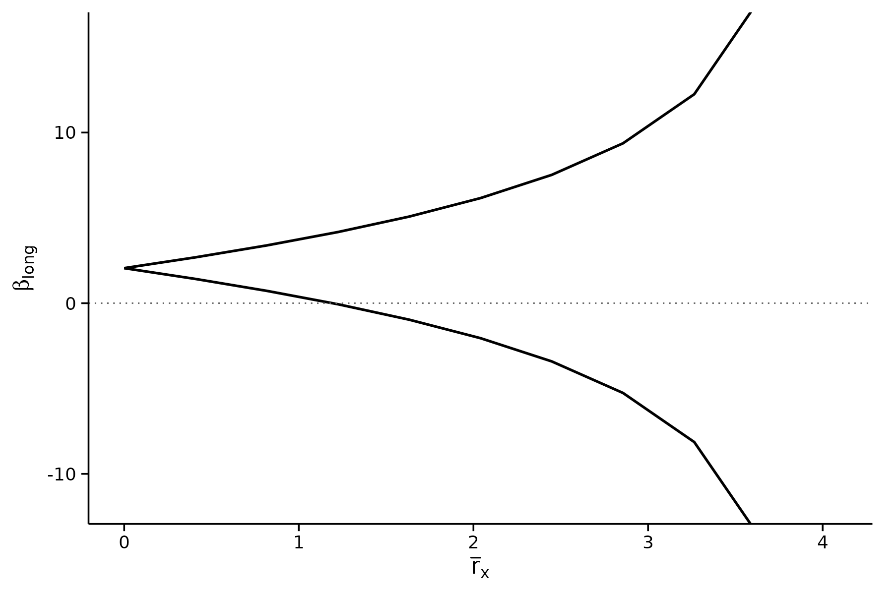
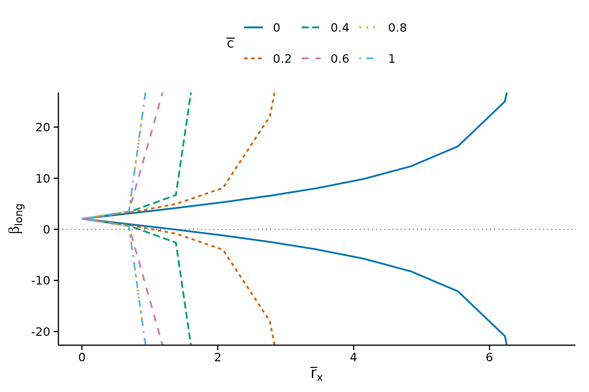
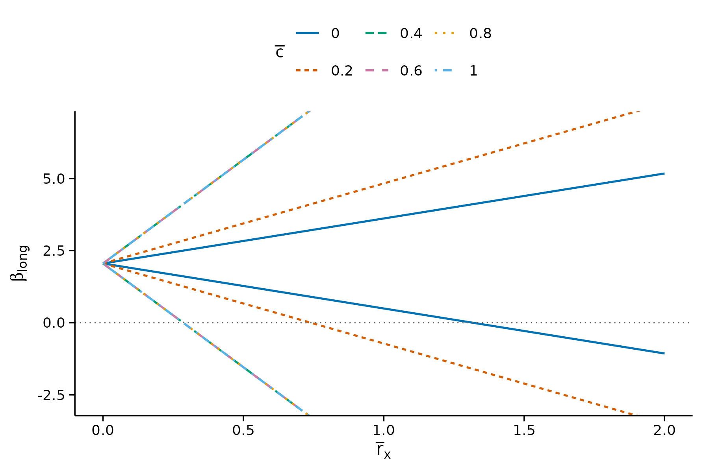
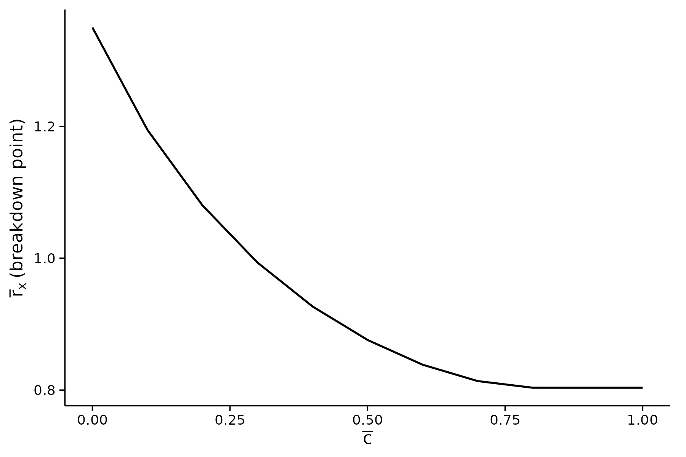
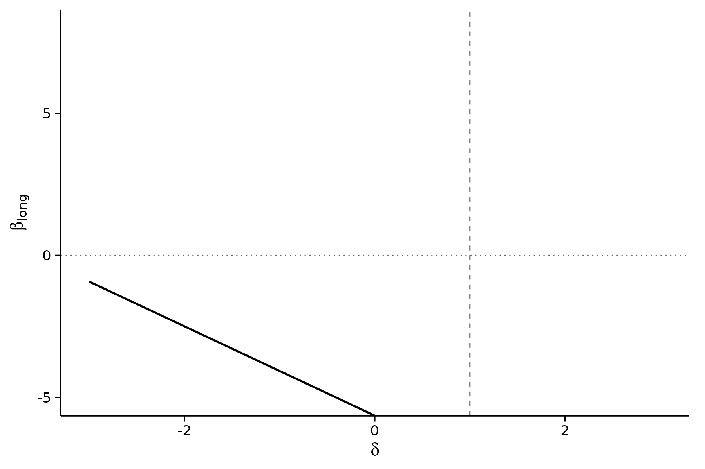
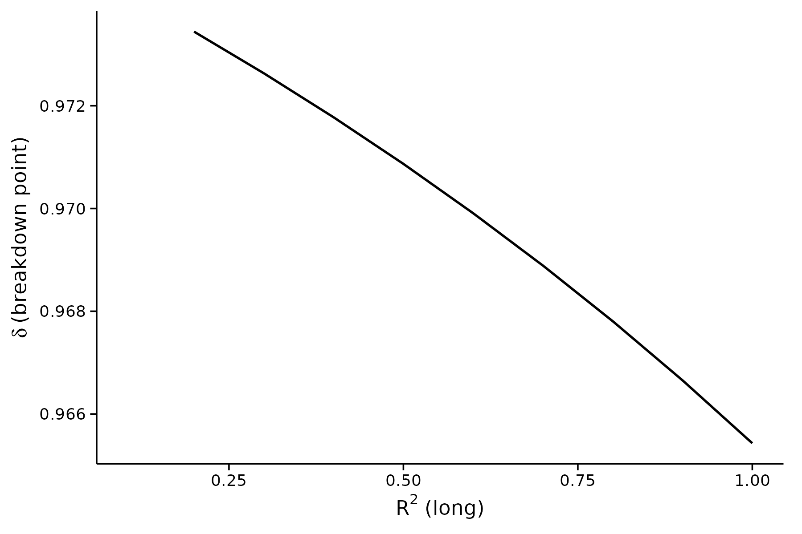

# Coming from the Stata package

The reference implementation of these methods is Masten and Poirier’s
Stata package, also called `regsensitivity`. This vignette maps its
syntax onto this package, command by command, using the same BFG (2020)
data that the Stata vignette uses.

It doubles as a coverage check. Every command in the Stata package’s own
vignette (shipped here as `inst/stata-reference/vignette.do`) appears
below with its R equivalent, so a gap would be visible rather than
implicit.

``` r

data(bfg2020)
bfg2020$statea <- factor(bfg2020$statea)

w1 <- c("log_area_2010", "lat", "lon", "temp_mean", "rain_mean",
        "elev_mean", "d_coa", "d_riv", "d_lak", "ave_gyi")

form <- avgrep2000to2016 ~ tye_tfe890_500kNI_100_l6 +
    log_area_2010 + lat + lon + temp_mean + rain_mean + elev_mean +
    d_coa + d_riv + d_lak + ave_gyi + statea
```

In Stata the outcome, treatment and controls are positional and the
comparison set is named separately:

``` stata
local y avgrep2000to2016
local x tye_tfe890_500kNI_100_l6
local w1 log_area_2010 lat lon temp_mean rain_mean elev_mean d_coa d_riv d_lak ave_gyi
local w0 i.statea
regsensitivity `y' `x' `w1' `w0', compare(`w1')
```

In R the same information is a formula plus `compare`. The first term on
the right-hand side is the treatment; everything else is a control.

## Command map

| Stata | R |
|----|----|
| `regsensitivity y x w, compare(w1)` | `regsen_summary(form, data, compare = w1)` |
| `regsensitivity bounds ...` | `regsen_bounds(form, data, ...)` |
| `regsensitivity breakdown ...` | `regsen_breakdown(form, data, ...)` |
| `regsensitivity plot` | `plot(result)` |
| `compare(w1)` | `compare = w1` |
| `nocompare` | `nocompare = TRUE` |
| `cbar(0(.2)1)` | `cbar = seq(0, 1, 0.2)` |
| `rxbar(0 2)` | `rxbar = c(0, 2)` |
| `rybar(2)` | `rybar = 2` |
| `rybar(=rxbar)` | `rybar_expr = function(rx) rx` |
| `beta(0 eq)` | `beta = bnd_eq(0)` |
| `beta(4 ub)` | `beta = bnd_ub(4)` |
| `beta(-1(.2)1 lb)` | `beta = bnd_lb(seq(-1, 1, 0.2))` |
| `beta(sign)` | `beta = "sign"` (the default) |
| `oster` | `analysis = "oster"` |
| `delta(-3 3 eq)` | `delta = c(-3, 3)`, `delta_type = "eq"` |
| `delta(0(.001).999 bound)` | `delta = seq(0, .999, .001)`, `delta_type = "bound"` |
| `rmax(0(.1)1)` | `r2long = seq(0, 1, 0.1)` |
| `plot, nolegend` | `plot(res, show_legend = FALSE)` |
| `plot, yrange(0 6)` | `plot(res, ylim = c(0, 6))` |
| `plot, ywidth(4)` | `plot(res, ywidth = 4)` |
| `plot, xline(1)` | `plot(res, xline = 1)` |
| `e(idset_table)` | `as.data.frame(res)` |
| `cluster(v)` on the regression | `regsen_boot(..., cluster = "v")` |

Two differences are worth flagging rather than burying in the table.

Stata’s `numlist` syntax `0(.2)1` means “from 0 to 1 in steps of .2”,
which is `seq(0, 1, 0.2)`. And Stata stores results in `e()` matrices
retrieved with matrix subscripts; here the results are already a data
frame, so `as.data.frame(res)` gives you the same content directly.

## The Stata vignette, translated

### Default summary

``` stata
regsensitivity `y' `x' `w', compare(`w1')
```

``` r

summ <- regsen_summary(form, bfg2020, compare = w1)
summ
#> 
#> === DMP (2026) bounds ===
#> 
#> Regression Sensitivity Analysis ----- Bounds
#> ------------------------------------------------------------------------
#> Analysis:          DMP (2026)
#> Treatment:         tye_tfe890_500kNI_100_l6
#> Outcome:           avgrep2000to2016
#> N (obs):           2036
#> Hypothesis:        Beta > 0
#> Breakdown point:   0.8036
#> 
#> --- Summary statistics ----------------------------------
#>   Beta (short)                  1.9246
#>   Beta (medium)                 2.0548
#>   R2 (short)                    0.0328
#>   R2 (medium)                   0.1051
#>   Var(Y)                      101.7387
#>   Var(X)                        0.9014
#>   Var(X_Residual)               0.8823
#> 
#> --- Results ---------------------------------------------
#>     rxbar rybar   cbar     bmin   bmax
#>         0  +Inf      1   2.0548 2.0548
#>  0.098939  +Inf      1   1.9064 2.2031
#>   0.19788  +Inf      1   1.7535  2.356
#>   0.29682  +Inf      1   1.5906 2.5189
#>   0.39576  +Inf      1   1.4106 2.6989
#>   0.49469  +Inf      1   1.2026 2.9069
#>   0.59363  +Inf      1  0.94779 3.1617
#>   0.69257  +Inf      1  0.60803 3.5015
#>   0.79151  +Inf      1 0.086812 4.0227
#>   0.89045  +Inf      1 -0.99272 5.1022
#>   0.98939  +Inf      1     -Inf   +Inf
#> 
#> === Oster (2019) breakdown ===
#> 
#> Regression Sensitivity Analysis ----- Breakdown Frontier
#> ------------------------------------------------------------------------
#> Analysis:          Oster (2019)
#> Treatment:         tye_tfe890_500kNI_100_l6
#> Outcome:           avgrep2000to2016
#> N (obs):           2036
#> Hypothesis:        Beta > 0
#> 
#> --- Summary statistics ----------------------------------
#>   Beta (short)                  1.9246
#>   Beta (medium)                 2.0548
#>   R2 (short)                    0.0328
#>   R2 (medium)                   0.1051
#>   Var(Y)                      101.7387
#>   Var(X)                        0.9014
#>   Var(X_Residual)               0.8823
#> 
#> --- Results ---------------------------------------------
#>    index breakdown
#>  0.13667   0.97393
#>  0.23667   0.97315
#>  0.33667   0.97232
#>  0.43667   0.97145
#>  0.53667   0.97052
#>  0.63667   0.96954
#>  0.73667    0.9685
#>  0.83667   0.96739
#>  0.93667   0.96622
#>        1   0.96543
```

### Bounds at a single `cbar`

``` stata
regsensitivity bounds `y' `x' `w', compare(`w1') cbar(.1)
regsensitivity plot
```

``` r

b1 <- regsen_bounds(form, bfg2020, compare = w1, cbar = 0.1)
plot(b1)
```



### Bounds over a grid of `cbar`

``` stata
regsensitivity bounds `y' `x' `w', compare(`w1') cbar(0(.2)1)
```

``` r

b2 <- regsen_bounds(form, bfg2020, compare = w1,
                     cbar = seq(0, 1, 0.2))
plot(b2)
```



### Restricting `rxbar` as well

``` stata
regsensitivity bounds `y' `x' `w', compare(`w1') cbar(0(.2)1) rxbar(0 2) plot
```

``` r

b3 <- regsen_bounds(form, bfg2020, compare = w1,
                     cbar = seq(0, 1, 0.2), rxbar = c(0, 2))
plot(b3)
```



### Breakdown frontier

``` stata
regsensitivity breakdown `y' `x' `w', compare(`w1') cbar(0(.1)1)
regsensitivity plot
```

``` r

bd <- regsen_breakdown(form, bfg2020, compare = w1,
                        cbar = seq(0, 1, 0.1))
plot(bd)
```



### Breakdown for a one-sided hypothesis

``` stata
regsensitivity breakdown `y' `x' `w', compare(`w1') cbar(0(.1)1) beta(4 ub)
```

``` r

bd_ub <- regsen_breakdown(form, bfg2020, compare = w1,
                           cbar = seq(0, 1, 0.1), beta = bnd_ub(4))
bd_ub
#> 
#> Regression Sensitivity Analysis ----- Breakdown Frontier
#> ------------------------------------------------------------------------
#> Analysis:          DMP (2026)
#> Treatment:         tye_tfe890_500kNI_100_l6
#> Outcome:           avgrep2000to2016
#> N (obs):           2036
#> Hypothesis:        Beta < 4
#> 
#> --- Summary statistics ----------------------------------
#>   Beta (short)                  1.9246
#>   Beta (medium)                 2.0548
#>   R2 (short)                    0.0328
#>   R2 (medium)                   0.1051
#>   Var(Y)                      101.7387
#>   Var(X)                        0.9014
#>   Var(X_Residual)               0.8823
#> 
#> --- Results ---------------------------------------------
#>   index breakdown
#>       0    1.2807
#>     0.1    1.1404
#>     0.2    1.0362
#>     0.3   0.95706
#>     0.4   0.89635
#>     0.5   0.85018
#>     0.6   0.81655
#>     0.7   0.79515
#>     0.8   0.78819
#>     0.9   0.78819
#>       1   0.78819
```

### Bounding the unobservable’s effect on the outcome

``` stata
regsensitivity bounds `y' `x' `w', compare(`w1') rybar(2)
regsensitivity bounds `y' `x' `w', compare(`w1') rybar(=rxbar)
```

``` r

b_ry  <- regsen_bounds(form, bfg2020, compare = w1, rybar = 2)
b_eq  <- regsen_bounds(form, bfg2020, compare = w1,
                        rybar_expr = function(rx) rx)
b_eq$breakdown
#> [1] 0.9583522
```

### Oster (2019)

``` stata
regsensitivity bounds `y' `x' `w', compare(`w1') oster
regsensitivity bounds `y' `x' `w', compare(`w1') oster delta(-3 3 eq) plot
regsensitivity plot, xline(1)
```

`xline()` marks a reference value on the x-axis; here it is
$`R^2_{max} = 1`$, the point past which the assumed long-regression fit
would exceed a perfect one.

``` r

os <- regsen_bounds(form, bfg2020, compare = w1,
                     analysis = "oster",
                     delta = c(-3, 3), delta_type = "eq")
plot(os, ylim = c(-5, 8), xline = 1)
```



### Oster breakdown over `rmax`

``` stata
regsensitivity breakdown `y' `x' `w', compare(`w1') oster rmax(0(.1)1) beta(0 eq)
regsensitivity breakdown `y' `x' `w', compare(`w1') oster rmax(0(.1)1) beta(sign)
```

``` r

os_bd <- regsen_breakdown(form, bfg2020, compare = w1,
                           analysis = "oster",
                           r2long = seq(0, 1, 0.1),
                           beta = bnd_eq(0))
os_sign <- regsen_breakdown(form, bfg2020, compare = w1,
                             analysis = "oster",
                             r2long = seq(0, 1, 0.1),
                             beta = "sign")
plot(os_sign)
#> Warning: Removed 2 rows containing missing values or values outside the scale range
#> (`geom_line()`).
```



## Coverage

Every option exercised by the Stata vignette has an equivalent above.
The one behaviour that is *not* carried over is Stata’s habit of leaving
results in `e()` for the next command to pick up: `regsensitivity plot`
with no arguments replots whatever ran last. Here each function returns
its result and [`plot()`](https://rdrr.io/r/graphics/plot.default.html)
takes it explicitly, which is what lets you keep several analyses side
by side in one session.

    #> R version 4.6.1 (2026-06-24)
    #> Platform: x86_64-pc-linux-gnu
    #> Running under: Ubuntu 24.04.4 LTS
    #> 
    #> Matrix products: default
    #> BLAS:   /usr/lib/x86_64-linux-gnu/openblas-pthread/libblas.so.3 
    #> LAPACK: /usr/lib/x86_64-linux-gnu/openblas-pthread/libopenblasp-r0.3.26.so;  LAPACK version 3.12.0
    #> 
    #> locale:
    #>  [1] LC_CTYPE=C.UTF-8       LC_NUMERIC=C           LC_TIME=C.UTF-8       
    #>  [4] LC_COLLATE=C.UTF-8     LC_MONETARY=C.UTF-8    LC_MESSAGES=C.UTF-8   
    #>  [7] LC_PAPER=C.UTF-8       LC_NAME=C              LC_ADDRESS=C          
    #> [10] LC_TELEPHONE=C         LC_MEASUREMENT=C.UTF-8 LC_IDENTIFICATION=C   
    #> 
    #> time zone: UTC
    #> tzcode source: system (glibc)
    #> 
    #> attached base packages:
    #> [1] stats     graphics  grDevices utils     datasets  methods   base     
    #> 
    #> other attached packages:
    #> [1] ggplot2_4.0.3        regsensitivity_0.1.1
    #> 
    #> loaded via a namespace (and not attached):
    #>  [1] vctrs_0.7.3        cli_3.6.6          knitr_1.51         rlang_1.3.0       
    #>  [5] xfun_0.60          otel_0.2.0         generics_0.1.4     S7_0.2.2          
    #>  [9] textshaping_1.0.5  jsonlite_2.0.0     labeling_0.4.3     glue_1.8.1        
    #> [13] htmltools_0.5.9    ragg_1.5.2         sass_0.4.10        scales_1.4.0      
    #> [17] rmarkdown_2.31     grid_4.6.1         evaluate_1.0.5     jquerylib_0.1.4   
    #> [21] fastmap_1.2.0      yaml_2.3.12        lifecycle_1.0.5    compiler_4.6.1    
    #> [25] RColorBrewer_1.1-3 fs_2.1.0           farver_2.1.2       systemfonts_1.3.2 
    #> [29] digest_0.6.39      nloptr_2.2.1       R6_2.6.1           bslib_0.12.0      
    #> [33] withr_3.0.3        tools_4.6.1        gtable_0.3.6       pkgdown_2.2.1     
    #> [37] cachem_1.1.0       desc_1.4.3
