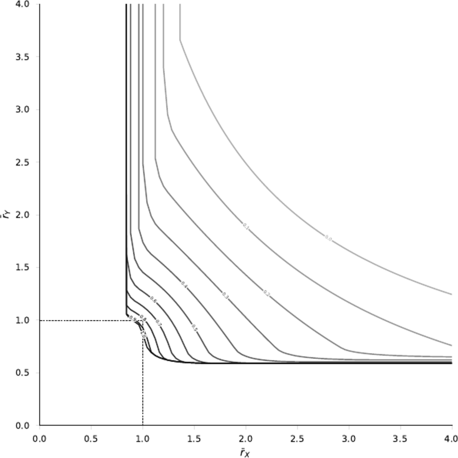
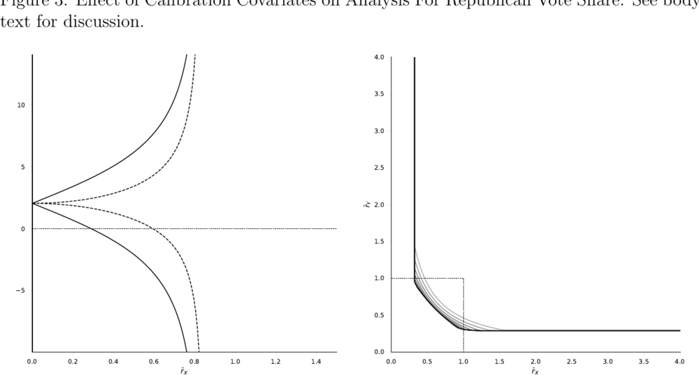
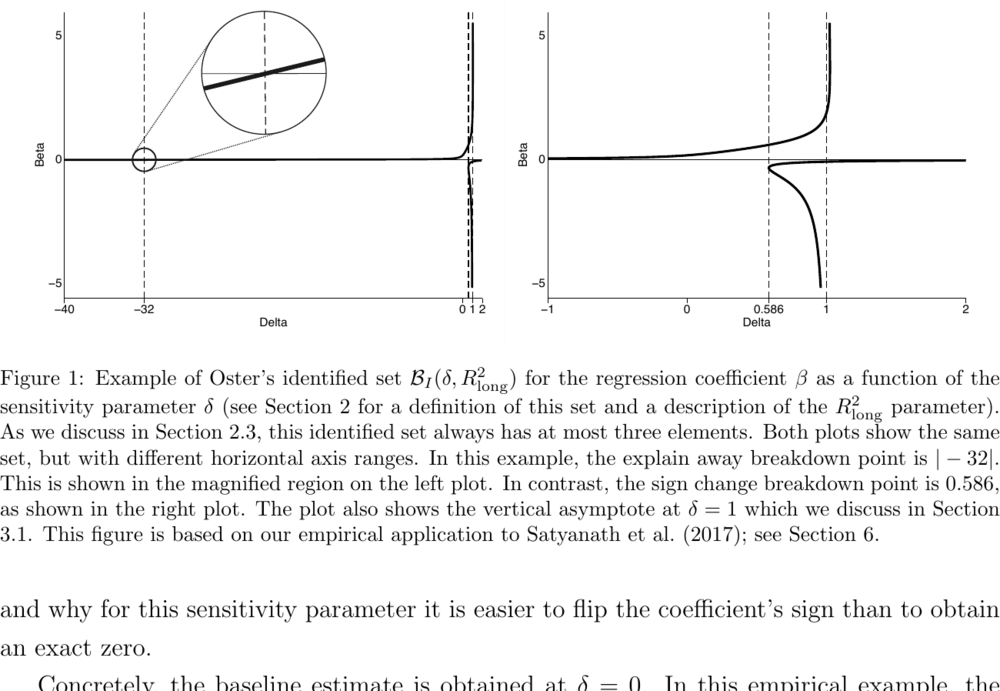
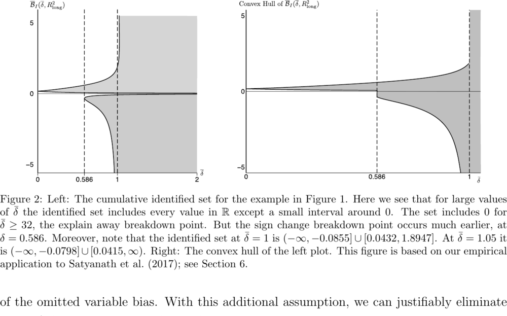

```{r setup, include = FALSE}
knitr::opts_chunk$set(
  collapse = TRUE, comment = "#>", echo = FALSE,
  fig.width = 6.2, fig.height = 4.4, dpi = 150
)
library(regsensitivity)
library(ggplot2)
```

A replication that only reports numbers asks you to trust that the
figures line up too. This page puts them next to each other.

The panels on the left are reproduced from **Diegert, Masten and Poirier
(2026),** [*Assessing Omitted Variable Bias when the Controls are
Endogenous*](https://arxiv.org/abs/2206.02303) (arXiv:2206.02303v6,
Figure 1), for the purpose of comparison. Copyright rests with the
authors. The panels on the right are produced by this package from the
bundled `bfg2020` data, by the code shown beneath each one.

This page is part of the website only. It is excluded from the package
tarball, so the reproduced figures are not redistributed on CRAN.

```{r data}
data(bfg2020)
bfg2020$statea <- factor(bfg2020$statea)
w1 <- c("log_area_2010", "lat", "lon", "temp_mean", "rain_mean",
        "elev_mean", "d_coa", "d_riv", "d_lak", "ave_gyi")
form <- avgrep2000to2016 ~ tye_tfe890_500kNI_100_l6 +
    log_area_2010 + lat + lon + temp_mean + rain_mean + elev_mean +
    d_coa + d_riv + d_lak + ave_gyi + statea
```

## Figure 1, left panel

Bounds on $\beta_{long}$ against $\bar r_X$ at $\bar c = 1$. Solid lines
leave $\bar r_Y$ unrestricted; dashed lines impose
$\bar r_Y = \bar r_X$. The marks on the zero line are the Table 4
calibration values.

### DMP (2026), as published


### regsensitivity

```{r fig1-left, echo = TRUE}
rx <- seq(0, 1.4, length.out = 300)
solid  <- regsen_bounds(form, bfg2020, compare = w1, cbar = 1, rxbar = rx)
dashed <- regsen_bounds(form, bfg2020, compare = w1, cbar = 1, rxbar = rx,
                         rybar_expr = function(r) r)

a <- as.data.frame(solid);  a$spec <- "rybar = Inf"
b <- as.data.frame(dashed); b$spec <- "rybar = rxbar"
df <- rbind(a[, c("rxbar", "bmin", "bmax", "spec")],
            b[, c("rxbar", "bmin", "bmax", "spec")])
df$bmin[!is.finite(df$bmin)] <- NA
df$bmax[!is.finite(df$bmax)] <- NA
ticks <- calibrate_rho(form, bfg2020, compare = w1)$rho / 100

ggplot(df, aes(x = rxbar, linetype = spec)) +
    geom_hline(yintercept = 0, colour = "grey30", linewidth = 0.3,
                linetype = "dotted") +
    geom_line(aes(y = bmin), linewidth = 0.5, na.rm = TRUE) +
    geom_line(aes(y = bmax), linewidth = 0.5, na.rm = TRUE) +
    annotate("segment", x = ticks, xend = ticks, y = -0.25, yend = 0.25,
              linewidth = 0.35, colour = "black") +
    scale_linetype_manual(values = c("rybar = Inf"   = "solid",
                                     "rybar = rxbar" = "dashed")) +
    scale_x_continuous(breaks = seq(0, 1.4, 0.2)) +
    scale_y_continuous(breaks = seq(-2, 6, 2)) +
    coord_cartesian(xlim = c(0, 1.5), ylim = c(-3.2, 7.2)) +
    labs(x = expression(bar(r)[X]), y = expression(beta[long]),
         linetype = NULL) +
    theme_regsen(base_size = 10) +
    theme(legend.position = "none")
```

The two curves cross zero at the paper's two breakdown points:

```{r crossings, echo = TRUE}
c(`rybar = Inf`   = abs(solid$breakdown),    # paper: 0.804
  `rybar = rxbar` = abs(dashed$breakdown))   # paper: 0.96
```

Both bounds go infinite at $\bar r_X = 1$ under the dashed
specification, and just below 1 under the solid one, which is where both
curves leave the panel in the published figure too.

## Figure 1, right panel

The breakdown frontier in $(\bar r_X, \bar r_Y)$ space, one curve per
$\bar c$.

### DMP (2026), as published



### regsensitivity

```{r fig1-right, echo = TRUE}
frontier <- function(cbar, rys) {
    rx <- vapply(rys, function(ry) {
        r <- try(regsen_breakdown(form, bfg2020, compare = w1,
                                   cbar = cbar, rybar = ry), silent = TRUE)
        if (inherits(r, "try-error")) NA_real_ else abs(r$results$breakdown[1])
    }, numeric(1))
    data.frame(rxbar = rx, rybar = rys, cbar = factor(cbar))
}
rys <- c(seq(0.6, 2, by = 0.2), 2.5, 3, 4)
fr  <- do.call(rbind, lapply(c(1, 0.9, 0.75, 0.5), frontier, rys = rys))

ggplot(fr, aes(x = rxbar, y = rybar, group = cbar, colour = cbar)) +
    geom_line(linewidth = 0.6, na.rm = TRUE) +
    scale_colour_regsen() +
    scale_x_continuous(breaks = seq(0, 4, 0.5)) +
    scale_y_continuous(breaks = seq(0, 4, 0.5)) +
    coord_cartesian(xlim = c(0, 4), ylim = c(0, 4)) +
    labs(x = expression(bar(r)[X]), y = expression(bar(r)[Y]),
         colour = expression(bar(c))) +
    theme_regsen(base_size = 10)
```

**Where this one stops short, and why.** The published panel runs to
$\bar r_X = 4$, each curve having flattened onto a horizontal arm. This
reproduction covers the vertical arm only. That arm carries the quantity
the paper reports -- each curve approaches $\bar r_X = 0.804$ as
$\bar r_Y$ grows, which is the breakdown point of Table 1, Panel C. The
horizontal arm lives in a region the package declines to compute:

```{r limit, echo = TRUE, error = TRUE}
regsen_bounds(form, bfg2020, compare = w1, cbar = 1, rxbar = 2, rybar = 0.6)
```

Rather than return a number it cannot stand behind, it raises that error.
So the missing arm is a stated limitation of the implementation, not a
disagreement with the paper.

## Figure 3: calibrating with state fixed effects

Figure 3 repeats Figure 1 with the state fixed effects moved *into* the
calibration set. The paper's point is that $\bar r_X$ is only meaningful
relative to the covariates it calibrates against: adding controls with a
lot of explanatory power raises selection on observables, so the same
data yields a much smaller breakdown point -- the paper says it drops
from about 80% to **about 30%**.

### DMP (2026), as published



### regsensitivity

```{r fig3, echo = TRUE}
w1_fe <- c(w1, "statea")          # state fixed effects now calibrate too
s3 <- regsen_bounds(form, bfg2020, compare = w1_fe, cbar = 1, rxbar = rx)
d3 <- regsen_bounds(form, bfg2020, compare = w1_fe, cbar = 1, rxbar = rx,
                     rybar_expr = function(r) r)

a3 <- as.data.frame(s3); a3$spec <- "rybar = Inf"
b3 <- as.data.frame(d3); b3$spec <- "rybar = rxbar"
df3 <- rbind(a3[, c("rxbar", "bmin", "bmax", "spec")],
             b3[, c("rxbar", "bmin", "bmax", "spec")])
df3$bmin[!is.finite(df3$bmin)] <- NA
df3$bmax[!is.finite(df3$bmax)] <- NA

ggplot(df3, aes(x = rxbar, linetype = spec)) +
    geom_hline(yintercept = 0, colour = "grey30", linewidth = 0.3,
                linetype = "dotted") +
    geom_line(aes(y = bmin), linewidth = 0.5, na.rm = TRUE) +
    geom_line(aes(y = bmax), linewidth = 0.5, na.rm = TRUE) +
    scale_linetype_manual(values = c("rybar = Inf"   = "solid",
                                     "rybar = rxbar" = "dashed")) +
    coord_cartesian(xlim = c(0, 1.5), ylim = c(-3.2, 7.2)) +
    labs(x = expression(bar(r)[X]), y = expression(beta[long]),
         linetype = NULL) +
    theme_regsen(base_size = 10) +
    theme(legend.position = "none")
```

```{r fig3-bp, echo = TRUE}
c(`w1 only`            = abs(solid$breakdown),   # paper: ~0.80
  `w1 + state effects` = abs(s3$breakdown))      # paper: ~0.30
```

`r sprintf("%.4f", abs(s3$breakdown))` against the paper's "about 30%".

## Masten and Poirier (2026), Figures 1 and 2

These two are built on the authors' application to Satyanath et al.
(2017), which is not bundled with this package, and the paper does not
report the full set of moments needed to rebuild that data. They are
shown here for structure, next to the stylized reproduction from the
[MP replication vignette](../articles/mp2022-stylized.html).

**This is not a numerical reproduction, and it should not be read as
one.** In the published figure the sign-change breakdown is 0.586 while
the explain-away breakdown is $|-32|$ -- a separation of a factor of 55,
which is precisely the asymmetry the figure exists to demonstrate. In
constructed data the two quantities come out close together; reproducing
the gap needs the actual Satyanath moments, not a plausible-looking
substitute.

### MP (2026) Figure 1, as published



### MP (2026) Figure 2, as published



The structural features do carry over to constructed data: the
identified set has at most three branches, and they diverge at the
vertical asymptote $\delta = 1$. Both are visible in the stylized
figures in that vignette.

## Coverage: every figure in the three papers

```{r coverage, echo = FALSE}
knitr::kable(data.frame(
  Figure = c("DMP Fig 1 (left)", "DMP Fig 1 (right)", "DMP Fig 2",
             "DMP Fig 3", "MP Fig 1", "MP Fig 2", "MP Fig S1",
             "Oster Figs 1-6"),
  Status = c("reproduced", "partly reproduced", "not reproducible",
             "reproduced", "structure only", "structure only",
             "not reproducible", "out of scope"),
  Reason = c(
    "matches on both specifications; crossings 0.8036 / 0.9584",
    "vertical arm matches; horizontal arm needs a region the package does not implement",
    "outcome 'Cut Spending on Poor' is not in the bundled bfg2020 data",
    "matches; breakdown falls to 0.2909 against the paper's 'about 30%'",
    "built on Satyanath et al. (2017); moments not reported in full",
    "as Figure 1",
    "Satyanath et al. (2017) data, not bundled",
    "meta-analysis across the published literature and NLSY simulations; not analyses this package performs"
  ),
  stringsAsFactors = FALSE
), caption = "What replicates, what does not, and why.")
```

Four of the eight are figures this package's methods actually produce
from the bundled data, and three of those four match. The rest need data
that is not distributed with the package, or -- in Oster's case -- are
about a literature rather than about a sensitivity analysis.

## Summary

| | Published | This package |
|---|---|---|
| $\bar r_X^{bp}$ at $\bar c = 1$ | 0.804 | `r sprintf("%.4f", abs(solid$breakdown))` |
| $\bar r^{bp}$, $\bar r_Y = \bar r_X$ | 0.96 | `r sprintf("%.4f", abs(dashed$breakdown))` |
| $\bar r_X^{bp}$, calibrating on state effects | ~0.30 | `r sprintf("%.4f", abs(s3$breakdown))` |
